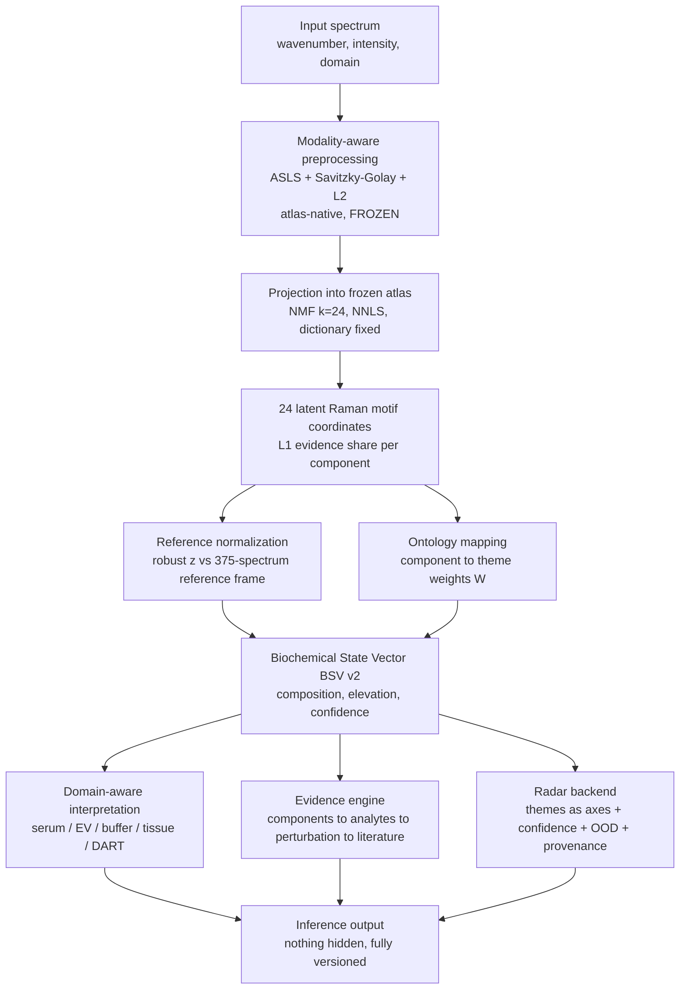
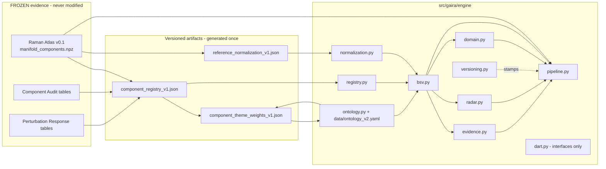
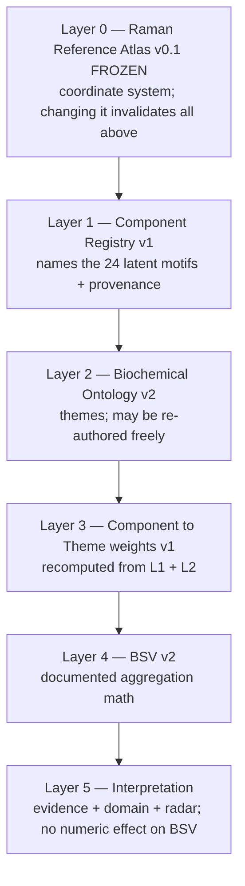
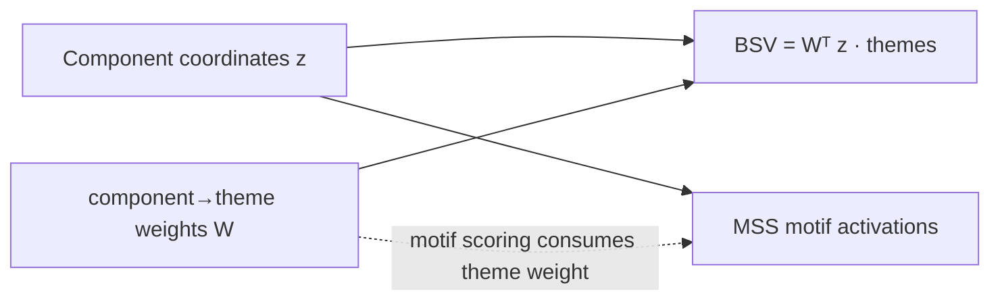

# GAIRA Converged Engine — Architecture (V6)

Canonical architecture documentation for `src/gaira/engine/`. The engine is a
deterministic biochemical reasoning stack built on the **frozen** Raman Reference
Atlas v0.1. No opaque ML; the only model is the frozen non-negative NMF basis
applied with the dictionary held fixed.

---

## 1. Data-flow diagram (Part 2)



The atlas box (C) is **immutable**: its fingerprint `09ed804a…` is verified on load
and never changes. Everything downstream is versioned interpretation.

---

## 2. Module diagram



---

## 3. Layered architecture (Part 13 — versioned, independent)



The key property: **the ontology (L2) can evolve without regenerating the frozen
coordinates (L0)**. A theme re-authoring only recomputes L3 upward.

---

## 4. BSV v2 equations (Part 6)

Query projected into the frozen atlas → non-negative activations `a ∈ R²⁴`.

```
coord_j       = a_j / Σ_k a_k                         # L1 evidence share per component
z_j           = (coord_j − center_j) / spread_j       # robust z vs reference frame (median/MAD)
W_{j,t}       = component→theme weight (rows sum to 1)

composition_t = Σ_j W_{j,t} · coord_j                 # theme's share of the evidence (≈ sums to 1)
elevation_t   = Σ_j W_{j,t} · z_j                     # how elevated vs pure references
display_t     = 0.5 + 0.5·tanh(elevation_t / 3)       # bounded 0..1

stability_t   = Σ_j W_{j,t} · stability_j             # weighted bootstrap stability
evidence_t    = 1 − normalized_entropy(W_{·,t}·coord) # evidence concentration
ood_factor    = 1 − OOD_score                         # cosine distance to reference support
confidence_t  = stability_t · evidence_t · ood_factor

overall_confidence = mean_t∈bio(confidence_t) · (1 − min(0.8, matrix+unknown share))
```

`composition` is the primary radar score (discriminating, ~sums to 1);
`display`/`elevation` express deviation from pure references; the non-biochemical
themes (`background_matrix`, `unknown_mixed`) are computed and reported so a large
matrix/unknown share lowers confidence rather than being silently absorbed.

---

## 5. Component→Theme weight construction (Part 5)

Each `W_{j,t}` combines three independent, recorded evidence lines
(`component_theme_weights_v1.json`), mixed with fixed weights and renormalised per
component to a distribution:

```
w = 0.50 · reference_loading_evidence      # families loading the component → themes
  + 0.25 · spectral_band_evidence          # component bands ↔ theme characteristic bands
  + 0.25 · perturbation_evidence           # chemically-specific driving analytes → theme
```

This is what let the engine correct the Component Audit's coarse labels: c3
(audit label "sterol") receives `nucleic_purine = 0.47` because adenine both loads
it (reference evidence) and drives it (perturbation evidence).

---

## 5b. MSS — a PARALLEL interpretive layer (dependency direction)

The Molecular Spectral Signatures (`src/gaira/engine/mss.py`,
`data/mss_motifs_v1.yaml`) are a **second, parallel** projection of the same 24
component coordinates — **they do not feed the BSV**.



- The **BSV is computed directly from `W`** (`composition = Wᵀ z`); `bsv.py` never
  imports MSS.
- Each MSS motif is a *curated* definition (bands + exemplars + `parent_theme`) whose
  contributing components are *derived* by scoring
  `0.40·band + 0.35·exemplar + 0.25·theme` (keep ≥ 0.15, top 6, normalise). Because that
  score **consumes the theme weight**, MSS is **downstream of / parallel to** themes —
  never their source.
- **Correct statement:** *themes are computed directly from the component→theme weights;
  MSS is a parallel explanatory overlay.* A UI may present MSS first (it is easier to
  read), but the mathematical dependency is component→theme→BSV, with MSS beside it.

---

## 6. Output structure (Part 12 — nothing hidden)

Every `GAIRAEngine.infer(...).as_dict()` returns:

| field | content |
| --- | --- |
| `biochemical_state_vector` | composition / elevation / display / confidence per theme + non-biochemical shares |
| `radar` | theme axes with score, ood-adjusted score, confidence, ood modifier, evidence strength, provenance handles |
| `evidence` | per-theme trace: components → reference analytes → perturbation support → literature → caveats; honesty flags |
| `domain_interpretation` | domain-specific reliable/expected themes + caveats (does not change the BSV) |
| `component_coordinates` | the 24 L1 shares |
| `ood_score`, `overall_confidence` | uncertainty summary |
| `versions` | every layer's version + the atlas fingerprint |

---

## 7. Implementation notes

- **Determinism:** projection uses `sklearn.non_negative_factorization(update_H=False)` (fixed dictionary); all downstream maths are closed-form. No randomness.
- **Provenance:** the registry stores `{value, provenance}` per field; theme weights store the three evidence lines per weight; the pipeline stamps `versions` (incl. atlas fingerprint) into every output.
- **Additivity:** the engine is a new package; it imports only `foundation` (frozen atlas), `preprocessing` (frozen), and reads the frozen study tables. It does not touch `inference.py`, `theme_ontology.py`, the demo, or any historical module.
- **Failure honesty:** OOD score, matrix share and unknown share are first-class outputs; low-purity components carry explicit caveats; the domain layer flags expected-but-uninformative signals (albumin in serum).
