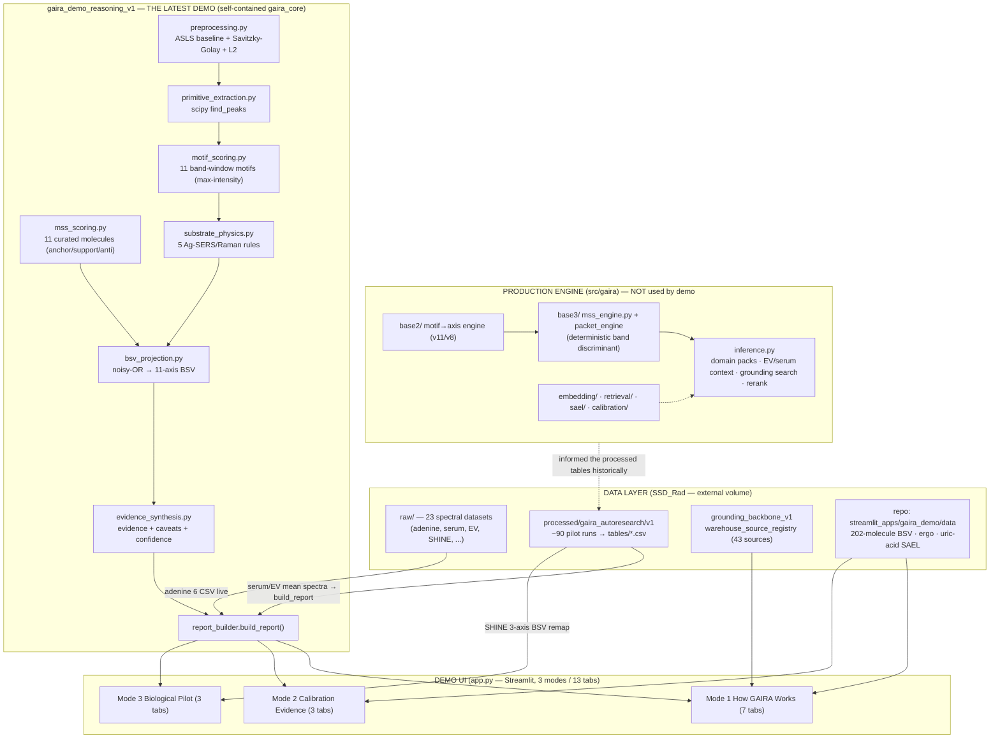

# GAIRA — Full Context & Current-State Audit

**Date:** 2026-07-15
**Auditor:** Claude Code (forensic, read-only)
**Machine:** new MacBook (`surajpg2`), repo at `/Users/surajpg/projects/GAIRA`, external volume `/Volumes/SSD_Rad` mounted at audit time.
**Scope:** local repo, SSD_Rad data, `gaira_demo_reasoning_v1` demo, datasets available vs actually used, inference/grounding/domain/embedding/visualization architecture.
**Method:** direct file reads + targeted CSV inspection + two parallel read-only sub-audits (SSD dataset inventory; main-repo/`src` map). No files were modified. Every quantitative claim below was read from code or data, not inferred from filenames or captions.

> **One-line current state:** GAIRA's *concept and documentation* are mature and scientifically disciplined; a *real production `src/gaira` engine* exists (base2 → base3/MSS → `inference.py`) but is **not** what the latest demo runs. The latest demo (`gaira_demo_reasoning_v1`) is a **self-contained, honest, mostly-real "reasoning story"** built on a **deliberately simplified heuristic engine** (11 curated band-window motifs → noisy-OR → 11-axis radar), reading real spectra/tables from SSD_Rad. It is credible for an external demo **provided** its BSV is presented as a transparent band-evidence heuristic, not a validated biochemical state model.

---

## 1. Executive summary

**What GAIRA is.** GAIRA ("GenAI Raman Analysis") is intended to be a *domain-aware, evidence-grounded scientific reasoning engine* for Raman/SERS spectra of biological samples. It converts a spectrum into an interpretable **Biochemical State/Support Vector (BSV)** across biochemical family axes, with explicit evidence tiers, substrate-aware caveats, and ambiguity routing — deliberately avoiding "this peak = this molecule" claims.

**Problem it solves.** Biofluid Raman/SERS spectra are *mixtures*, not fingerprints; the literature routinely overclaims molecular assignments by matching nearby wavenumbers. GAIRA's design goal is to produce cautious, class-level, source-backed biochemical interpretation with tracked uncertainty, so that downstream (eventually DART-Met dynamic electrochemical perturbation) work rests on a defensible evidence layer.

**Scientific philosophy (verified consistent across `claude.md`, `gaira-base.md`, `gaira-core-concepts.md`, `gaira-build-principles.md`):** determinism first; primitives before motifs; spectra are mixtures; peak ≠ molecule; overcomplete candidate axes then prune via calibration; **ΔBSV is the primary object, absolute BSV is supporting context**; disease literature must never define BSV axes (anti-circularity); calibration is the legitimacy test; preserve provenance; transparent scoring over opaque latent logic.

**What is currently functional.**
- A real importable production package `src/gaira` with a layered, deterministic, band-based inference stack (base2 axis engine → base3 packet/MSS engine → `inference.py` orchestration with domain packs, EV/serum context, grounding search + reranking).
- A large processed-evidence estate on SSD_Rad: a 43-source grounding warehouse, a 202-molecule reference BSV table, and ~90 "autoresearch" pilot runs (small2023 EV, SHINE EV-SERS, CCA/HCC/LM serum, diabetes EV, COVID serum) with per-spectrum/per-sample/per-patient BSV tables.
- A polished, self-contained Streamlit demo (`gaira_demo_reasoning_v1`) that **currently loads real data** for 8 of 9 sections (SSD mounted) and is unusually honest about provenance and limitations.

**What remains partial, simulated, or aspirational.**
- The **demo's inference engine is a simplified heuristic**, not the production `src/gaira` engine — it is never imported by the demo. The demo's BSV = max L2-normalized intensity in ~11 hand-picked band windows, noisy-OR'd. This is a transparent band-evidence heuristic, not a learned or calibrated biochemical model.
- **`base4` does not exist** despite doc/README references to `src/gaira/base3/mss_engine.py` "far richer" production code (base3 is the top layer).
- Embeddings, UMAP, learned ontology, cross-dataset retrieval exist in `src/gaira` but are **not used by the demo**. The demo's "11-axis biochemical space" UMAP is a projection of the 202-molecule *ontology* BSV, not of measured spectra or a trained model.
- Migration breakage: **172 stale `/Users/suraj/` paths**, thousands of `/Volumes/SSD_Rad` hardcodes; the demo works only because the SSD is mounted and the demo's own paths happen to be correct.

**Single most accurate description of the current latest state:** *"A scientifically careful, mostly-real, self-contained Raman/SERS reasoning demo backed by real SSD data, running a transparent heuristic band-evidence engine that is intentionally simpler than — and disconnected from — the real production `gaira` package."*

---

## 2. Current architecture



**Layer separation as actually built:**
- **Data layer** — real, on SSD_Rad + a small set of legacy CSVs committed in the repo (`streamlit_apps/gaira_demo/data`). Rich but heterogeneous.
- **Grounding layer** — two distinct things both called "grounding": (a) the **202-molecule reference BSV table** (RamanBioLib-derived; used for the biochemical-space viz), and (b) the **43-source evidence warehouse registry** (used for the corpus map). Both real.
- **Domain context** — production `src/gaira` has `serum_context.py`, `ev_context.py`, `domain_pack_registry.py`. **The demo does not use them.** The demo's only domain-awareness is 5 substrate rules + hardcoded per-tab captions.
- **Inference engine** — *two exist and are disjoint:* the production `src/gaira` stack (unused by demo) and the demo's own `gaira_core` heuristic (what actually runs).
- **Demo/UI** — `app.py`, 3 modes, 13 tabs, Plotly dark theme.
- **Outputs** — radars, ΔBSV bars, dose curves, UMAP/PCA scatter, evidence/caveat cards. No files written at runtime.

---

## 3. End-to-end inference walkthrough (what actually runs)

Tracing one spectrum through the **demo** (the runtime target), e.g. an adenine Ag-SERS concentration or a serum-liver cohort mean:

1. **Ingestion** — a raw CSV/JSON spectrum is read.
   - Adenine: `data_loader._read_adenine_csv` (cp1252, `;`-sep, comma-decimal) → `_crop_and_interp` to 400–1800 cm⁻¹ on a 1401-pt/1 cm⁻¹ grid (`numpy.interp`, zero outside range).
   - Serum liver / EV: `_load_serum_liver_from_spectra` / `_load_ev_diabetes_from_spectra` read pre-averaged cohort/patient mean spectra and interpolate onto the same grid.
2. **Preprocessing** — `preprocessing.preprocess`: Savitzky–Golay smooth → **ASLS baseline** (Eilers–Boelens, λ=1e5, p=0.01, 8 iters) → clip to ≥0 → **L2 normalize**. (`report_builder.build_report:29`)
3. **Primitives** — `primitive_extraction.primitives_from`: `scipy.signal.find_peaks` (prominence floor 0.005, min-distance 6 cm⁻¹). *Peaks are computed and counted but do not feed scoring* — motif scoring reads the spectrum directly.
4. **MSS scoring** — `mss_scoring.score_all`: for each of 11 curated molecules, take the **max intensity within ±8–10 cm⁻¹** of each anchor/support/anti band; `fire = max(0, anchor·(1+0.4·support) − 0.5·anti)`.
5. **Motif scoring** — `motif_scoring.score_motifs`: for each of 11 class motifs, geometric-mean of **max intensity in each band window**; all bands of a multi-band motif must fire or the motif is 0.
6. **Substrate correction** — `substrate_physics.apply_substrate_corrections`: 5 rules; e.g. Ag-SERS purine motif ×0.65 (dampen), thione ×1.20 (boost). Only motif-level multipliers are applied to scores; axis-level rules become caveats.
7. **BSV projection** — `bsv_projection.project_to_bsv`: **noisy-OR** (`1−∏(1−s)`) over motif scores mapped to each motif's single **primary axis**, plus a small (weight 0.25) MSS contribution spread over a curated per-molecule axis profile. Output = 11-axis dict in [0,1].
8. **Evidence synthesis** — `evidence_synthesis`: axes above 0.10 get "consistent-with" evidence cards (high ≥0.25); coupled-axis ambiguity caveats (purine↔metabolite, lipid↔sterol, protein↔aromatic) fire when both >0.10; substrate caveats when axis >0.05.
9. **Confidence** — `overall_confidence`: from top value and margin (moderate-high if top≥0.30 & margin≥0.10); substrate sensitivity keyed to substrate ("Ag colloid SERS"→high).
10. **Report** — `build_report` returns the `GAIRAReport` dict; UI renders spectrum, motif table, substrate events, radar (`radial_max=1.0` or dynamic), top axes, evidence, caveats.

**Responsible files:** `gaira_demo_reasoning_v1/gaira_core/{preprocessing,primitive_extraction,mss_scoring,motif_scoring,substrate_physics,bsv_projection,evidence_synthesis,report_builder}.py`; UI in `app.py`.

**Scientific characterization:** every step is **deterministic and heuristic**. No learning, no fitting to data, no calibration coefficients. The BSV is essentially *"how tall is the normalized spectrum inside 11 predefined windows, OR-combined."* This is defensible as a *transparent evidence display* and matches the docs' "transparent scoring over opaque latent logic" principle — but it is **not** the calibrated ΔBSV object the core-concepts doc defines as GAIRA's primary scientific output.

---

## 4. Repository map

Root: `/Users/surajpg/projects/GAIRA` (git branch `migration-safety-gaira-2026-07-05`; last commit "Migration safety snapshot before new Mac transition").

| Folder | Role |
| --- | --- |
| `gaira_demo_reasoning_v1/` | **The latest demo (audit primary).** Self-contained `gaira_core` package + `app.py` + empty `data/` subdirs + 3 markdown audit docs. Does not import `src/gaira`. |
| `src/gaira/` | **Production package (real, importable, NOT installable — no pyproject/setup).** base2 (motif/axis), base3 (mss_engine.py + packet_engine + learned_ontology), inference.py, plus spectral/, sael/, calibration/, expected/, embedding/, retrieval/, evidence_v1/, parsers/, substrate/, atlas/, domain packs, ev_context/serum_context, llm/. **No base4.** |
| `streamlit_apps/` | ~15 Streamlit UIs: command centers v1/v2/restored, context-graph explorers v1/v2, `gaira_demo`/`_v2`/`_v3`, `gaira_v3`, `gaira_v4` (newest, Apr 17), LFM query apps v1/v2…v2_5, literature ops console, manual rescue. Also hosts `gaira_demo/data/` legacy CSVs the new demo reads. |
| `scripts/` | 393 one-off run/experiment scripts (`run_gaira_base_*`, calibration, rescue loops). The de-facto "how work happened" layer. |
| `app/` | Older app entry points (search_demo, landscape v5_1, query demo). |
| `analysis/` | `make_publication_figures.py`, `run_diabetes_gaira_audit.py` — both hardcode stale `/Users/suraj/` paths. |
| `graph/`, `landscape/` | PhaseC query-router rules + precomputed BSV/condition landscape CSVs. |
| `config/` | `domain_pack_registry.yaml`, `spectral_anchor_windows_v1.csv`, `expected_bsv_anchor_windows.csv`, inference-lane registries, `storage.yaml`. |
| `reports/`, `docs/`, `results/`, `outputs/`, `figures/` | 356 / 105 / 174 / 73 / 9 files — phase reports, design docs, run outputs, generated artifacts, PNGs. |
| `tests/` | **One** test file (`test_gaira_base_2.py`), hardcodes an old path. |
| `data/`, `tmp/`, `logs/`, `dashboard/`, `lib/` | data assets; scratch; empty logs; single dashboard app; vendored JS/CSS. |
| root junk | Two ~2 MB files literally named `<_duckdb.DuckDBPyConnection object at 0x…>` — accidental artifacts (a DuckDB connection `repr()` used as a DB path). Not referenced by code. |

**Key documentation files (read, not just listed):**
- `claude.md` / `CLAUDE.md` — evidence-engine mission, 3-layer data architecture (candidate→staging→final), Phase A–F + D.5 MCP policy, working root `/Volumes/SSD_Rad/GAIRA_DATA/structured_evidence_v2/`.
- `gaira-base.md` — GAIRA-Base spec: spectrum→BSV + per-axis support/conflict; primitives first-class, motifs derived; central grounding evidence-object schema; overcomplete axes then prune; **calibration is the legitimacy test**; per-sample (not cohort-mean) BSVs.
- `gaira-core-concepts.md` — five-layer program (Base→Validate→Cohort→Interpret→Dynamic); **global embeddings rejected as foundation**; domain packs live in Interpret; **§26–30: ΔBSV is primary, absolute BSV secondary**; Phase 2.3 canonical anchors (Ergothioneine dose-response LOD 0.4 µM; Adenine binary over 6 orders; Methionine weak-clean).
- `gaira-build-principles.md` — 8 rules (determinism, disease-agnostic core, primitives-before-motifs, calibration legitimacy, provenance, transparent scoring, overcomplete-then-prune, human-auditable vault + machine scoring).
- Demo docs: `README.md`, `AUDIT_NEXT_DEMO.md`, `BIOLOGICAL_PILOT_BSV_AUDIT.md` — high-quality, self-critical provenance logs (see §12).

**Contradiction to flag:** docs/README reference `src/gaira/base3/mss_engine.py` as the "far richer production" MSS engine — this file **does exist and is real** (531 LOC, deterministic discriminant scorer). But README also implies the demo is a simplification "of" it; in fact the demo shares *no code* with it. And `base4` is referenced nowhere-real (does not exist).

---

## 5. Dataset master inventory

All datasets discovered across the repo and SSD_Rad. "Used by demo" is proven in §6.

### 5a. Raw spectral datasets — `/Volumes/SSD_Rad/GAIRA_DATA/raw/` (23 distinct)

| Dataset (folder) | Domain / sample | Raman/SERS | Format · files | Notable shape | Provenance role |
| --- | --- | --- | --- | --- | --- |
| `adenine_sers_control` | Adenine standard | SERS (bAgNPs) | 17 CSV (+xlsx/pdf) | 2-col wn;intensity | **Calibration — used live by demo** |
| `european_multi_instrument_adenine` | Adenine inter-lab | SERS | 7,033 (7032 txt + ILSdata.csv 3517 rows) | ×substrate×laser×conc | Reproducibility benchmark (largest raw set) |
| `ergothioneine_serum` | Serum + Ergo | SERS | 1 CSV | ERG_calibration | Calibration (dose) |
| `serum_ag_colloids` | Serum + Ag, uricase spike | SERS | zip 911 txt | serum ± enzyme | Calibration / grounding |
| `cspp_serum` | Serum (CSPP) | SERS | 5 CSV + 1056-spectrum zip | Fig2–7 | Uric-acid/hypoxanthine calibration source |
| `serum_protocol_comparison` | Serum protocols p1–p5 | SERS | 75 txt | protocol compare | Preprocessing robustness |
| `cca_hcc_lm_serum_sers` | Serum, liver cancers | SERS | 234 txt (BWTek) | CCA/HCC/LM | **Serum-liver pilot source** |
| `hcc_serum` | Serum, HCC | SERS | data.csv 144×2051 + zip | class/sample | **Registered but SKIPPED (not ingested)** |
| `nature_serum_sers` | Serum | SERS | 2 xlsx (SI) | supplement | Grounding/context |
| `shine_ev_sers` | EV, hepatotoxicity | SERS | zip + 2 mat | APAP dose×day | **SHINE pilot source (15,027 spectra)** |
| `small2023_ev` | EV cell-line/mixture | SERS | 2 mat + zip | fingerprints | Pilot1 source |
| `diabetes_plasma_ev_sers` | Plasma-EV, diabetes | SERS | patient_data 65 + mat/zip | HbA1c/BMI meta | **EV-diabetes pilot source** |
| `single_vesicle_ev_raman` | Single-vesicle EV | Raman | 1 rar (unextracted) | — | Context |
| `ovarian_plasma_raman_sers` | Plasma, ovarian | Raman + SERS | 2 zip × 385 txt | paired modality | Context / global_v2 |
| `ucla_saliva_sev_gc` | Saliva sEV, gastric ca | Raman/SERS | 2,231 txt + manifest | figshare shards | Context / global_v2 (2nd largest) |
| `mycoplasma_na_sers` | Nucleic-acid SERS | SERS | 1 CSV 2747×522 (CR endings) | group-labeled | Context / global_v2 |
| `coeliac_faecal_sers` | Faecal, coeliac | SERS | zip 30 txt | CTR/GFD | Context / global_v2 |
| `stroke_urine_sers` | Urine, stroke | SERS | 1 rar (unextracted) | — | Context / global_v2 |
| `otc_drugs` | OTC drug standards | Raman/SERS | 14 xlsx | aspirin/ibuprofen/paracetamol | Drug-detection MSS |
| `amino_acid_raman_grounding` | Amino acids | Raman | 2 xlsx | 20 standards | **Tier-1 grounding (20 spectra)** |
| `sers_metabolite_63` | 63 metabolites | SERS | 2 xlsx (NIHMS1547448) | fingerprints | **Tier-1 grounding** |
| `metabolite_sers63_support` | Fityk fits for above | fit products | 128 .fit + 126 .peaks | peak fits | Support for sers_metabolite_63 |
| `covid_serum_raman` | Serum, COVID | Raman | 7 txt matrices | 899×159 + wn vector | Pilot5 source |

### 5b. Reference / knowledge libraries

| Dataset | Format | Content |
| --- | --- | --- |
| `raman_knowledge_core` | 7 CSV | peak_assignments (85), knowledge_chunks (97), biomarker_claims (13), semantic_regions (12), sources (6) — ontology backbone, no spectra |
| `ramanbiolib` | zip + repo | RamanBioLib reference library snapshot (basis of the 202-molecule BSV table) |

### 5c. In-repo legacy CSVs — `streamlit_apps/gaira_demo/data/` (committed, **directly read by the new demo**)

| File | Rows | Content |
| --- | --- | --- |
| `grounding_molecule_bsv.csv` | 202 | 8 legacy axes per molecule + dominant axis |
| `grounding_molecule_index.csv` | 202 | type (69 Proteins, 21 FA, 20 TG, 13 AA…), substrate (CaF₂/glass ⇒ Raman) |
| `ergothioneine_dose_response.csv` | 88 | 11 conc (0–2 µM) × 8 axes, SAEL-derived |
| `calibration_conditions.csv` | 5 | SAEL contrasts (demo uses 3 uric-acid ones) |
| `calibration_delta_bsv.csv` | 40 | per-axis Δ + verdict per contrast |

### 5d. In-house lab data (not in raw/, not used anywhere yet)

| Source | Files | Content |
| --- | --- | --- |
| `/Volumes/SSD_Rad/LAB_DATA/Cracked_Au/` | 5,252 CSV | 4-MBA on cracked-Au (2,500) + porous-Au EV/RNA (2,752); per-point mapping spectra (Pixels,Wavenumber,Intensity). **Distinct in-house dataset, wired nowhere.** |

### 5e. Processed estate — `/Volumes/SSD_Rad/GAIRA_DATA/processed/gaira_autoresearch/gaira_autoresearch_v1/`
~90 pilot runs, each with `tables/*.csv`. Largest: `pilot1b_small2023_mixture_fingerprint` (per_spectrum_bsv 85,584; retrieval_hits 427,916); `pilot3_shine_*` (23,647 per-spectrum BSV); `pilot4_cca_hcc_lm_serum_sers` (9,574). `global_v2_ingest`/`global_v2_preprocessed` are **processed duplicates** of the six newer raw datasets (do not double-count).

### 5f. Registry manifest — `exports/rebuild_dataset_summary.csv` (14 registered datasets)
ramanbiolib (202 ref), raman_knowledge_core, shine_ev_sers (23,646), small2023_ev (29,024), serum_ag_colloids (386), serum_protocol_comparison (75), cspp_serum (528), serum_ag_colloids_grounding (368), + 2 literature-grounding, ergothioneine_serum (55), **hcc_serum = SKIPPED**, diabetes_plasma_ev_sers (31,834).

**Anomalies:** `serum_ag_colloids_grounding` and `serum_ag_colloids_literature_grounding` raw folders are **empty (0 files)**; `hcc_serum` registered but skipped; two unextracted `.rar` datasets; processed duplicates under `global_v2_*`.

---

## 6. Datasets *actively used* by the current demo (proven by code trace)

Only these are loaded at runtime. Everything else in §5 is available but unwired **in the demo** (some are used upstream to produce the processed tables below).

| Demo section | Loader (`data_loader.py`) | Exact source read | Live/cached | Evidence tier |
| --- | --- | --- | --- | --- |
| 11-Axis Biochemical Space | `load_reference_points` | `streamlit_apps/gaira_demo/data/grounding_molecule_bsv.csv` + `_index.csv` (202 mol) | cached CSV, remap 8→11 | reference (Raman) |
| Grounding Corpus Map | `_load_grounding_corpus_real` | `…/grounding_backbone_v1/tables/warehouse_source_registry.csv` (43) + `grounding_peak_support_summary.csv` | cached CSV | mixed |
| Ergothioneine dose | `load_ergothioneine_dose` | `…/gaira_demo/data/ergothioneine_dose_response.csv` (11 conc) | cached CSV, remap 8→11 | calibration |
| **Adenine detection** | `_load_adenine_real` → `build_report` | `/Volumes/SSD_Rad/GAIRA_DATA/raw/adenine_sers_control/Adenine_bAgNPs_*.CSV` (6 files) | **LIVE** (6 build_report calls) | calibration (Ag-SERS) |
| Uric acid validation | `load_uric_acid_validation` | `…/gaira_demo/data/calibration_conditions.csv` + `calibration_delta_bsv.csv` (3 SAEL contrasts) | cached CSV, remap 8→11 | calibration (SAEL, literature-anchored) |
| **Serum Liver** | `_load_serum_liver_from_spectra` → `build_report` | `…/pilot4_1_cca_hcc_lm_serum_patient_level/tables/patient_level_mean_spectra.csv` (212 mean spectra; 4/cohort sampled) | **LIVE** (build_report on real spectra) | pilot |
| **EV Diabetes** | `_load_ev_diabetes_from_spectra` → `build_report` | `…/pilot2_target_validation_v1/tables/sample_query_spectra.csv` (63; Impact 39/Strong-D 24; 8/cohort) | **LIVE** (build_report on real spectra) | pilot |
| SHINE Liver Injury | `_load_shine_real` | `…/pilot3_shine_single_set_day0_day2/tables/class_mean_bsv_day0_day2.csv` + `pilot3_shine_ev_sers/tables/per_sample_bsv.csv` | cached autoresearch BSV, remap 8→11 | pilot (3-axis upstream) |
| Family fingerprints (expanders) | `load_*_family_fingerprint` | SHINE/EV/liver `*family*.csv` | cached CSV, not remapped | complementary |
| Per-axis family counts | `load_family_counts` | — (none) | **hardcoded placeholder** | n/a |
| End-to-End / MSS / Collision spectra | `synth_reference_spectrum` | Gaussian-bump synthesis | **synthetic by design** | n/a |

**Proven-unused in the demo (available only):** all of `src/gaira` (base2/base3/mss_engine/inference/embedding/domain packs/context retrievers); every raw dataset except `adenine_sers_control`; `hcc_serum`; `LAB_DATA/Cracked_Au`; the ~85 processed pilot runs other than the 4 tables above; `raman_knowledge_core`; the `european_multi_instrument_adenine` benchmark.

**Runtime conditionality:** every SSD-backed loader is guarded `real-first → placeholder-fallback`. With SSD mounted (current state) 8/9 load real. **If SSD_Rad unmounts, adenine/grounding-map/serum-liver/EV/SHINE silently revert to placeholders** and flip the purple badge — no crash, but "real" becomes "demo" without the operator necessarily noticing beyond the badge.

---

## 7. Grounding corpus audit

There are **two grounding corpora**, often conflated:

**(A) Reference-molecule BSV table (biochemical-space tab).**
- **202 molecules**, 8 legacy axes each, RamanBioLib-derived. Types: 69 Proteins, 21 fatty acids, 20 triglycerides, 13 amino acids, 12 monosaccharides, etc.
- Substrate metadata is CaF₂/glass ⇒ **Raman powder/standard**, not SERS, not biofluid.
- Direct vs indirect: these are **direct reference spectra of pure compounds**, but the "BSV" shown is a precomputed 8-axis projection remapped 8→11 for display — a *visualization of the ontology*, not measured biofluid biochemistry.

**(B) Evidence warehouse registry (corpus-map tab).**
- **43 sources**: 30 `disease_or_stress_paper`, 12 `reference_molecule`, 1 `serum_grounding`. Modality: 22 raman, 14 mixed, 7 sers. Biosample: 37 none, 4 ev, 2 serum.
- Per-source measured counts (from `grounding_peak_support_summary.csv`): adenine_sers_control 12 spectra/68 peaks/12 classes; amino_acid_raman_grounding 20/245/20; metabolite/serum sources similar order. Only a handful of sources carry spectrum counts; the 30 disease/stress papers are **literature context (Tier 2), not spectra**.
- **Tier structure as coded:** `reference_molecule` + `serum_grounding` → Tier 1 (direct); `disease_or_stress_paper` → Tier 2 (literature). This is honest — but note **Tier 1 here includes literature-derived reference assignments**, and the demo's per-axis "family counts" that would quantify Tier-1 breadth are **still a hardcoded placeholder** (no `per_axis_grounding_counts.csv` exists).

**Counts by definition (to avoid the "N analytes" trap):**
- Source publications in warehouse: **43**. Reference-molecule sources: **12**. Disease/stress literature: **30**.
- Reference molecules in the space table: **202** (pure-compound Raman references).
- Directly-measured grounding spectra with counts in the summary: on the order of **~100–200** across the counted Tier-1 sources (adenine 12 + AA 20 + metabolite-63 ~64 + serum Ag ~64), **not** thousands.
- Embedding status of grounding: production `src/gaira/embedding` exists, but **the demo uses no embeddings** for grounding — it uses the precomputed 8-axis BSV table and the registry CSV.
- Provenance completeness: good at the source level (registry has provenance columns); **weak at the spectrum level** for the demo (spectrum-count join covers only some sources; per-axis rollup missing).

---

## 8. Domain packs and context — is domain-aware reranking active?

**In production `src/gaira`:** yes, real. `domain_pack_registry.py` + `config/domain_pack_registry.yaml`, `serum_context.py`, `ev_context.py`, `inference_reranking.rerank_grounding_hits`, `query_routing.py` implement domain-aware retrieval and reranking (GAIRA_EV / GAIRA_SERUM style separation, matching the docs).

**In the demo (what runs):** **domain-aware reranking is NOT active.** The demo has:
- A `domain` string threaded through `build_report` ("serum" / "extracellular_vesicle" / "calibration") that only affects a UI pill ("Domain: strong/caution") and never changes scoring or retrieval.
- 5 substrate rules (Ag-SERS / Raman) that *do* multiplicatively adjust motif scores — this is substrate-aware, not domain-matrix-aware.
- No EV-vs-serum downweighting, no cross-domain evidence reranking, no retrieval at all (nothing is retrieved; the BSV is computed directly from the query spectrum).

So the conceptual `GAIRA_EV` / `GAIRA_SERUM` / `GAIRA_GROUNDING` / `*_CONTEXT` packs from the brief **exist as production code and config but are absent from the demo's runtime path.** The demo's "EV" and "serum" tabs differ only by which spectra are loaded and by hardcoded caption text — the *scoring engine is identical across domains*.

---

## 9. BSV, MSS, embeddings, UMAP — concept vs implementation

| Concept | Intended (docs) | Demo implementation | Production `src/gaira` | Scientific read |
| --- | --- | --- | --- | --- |
| **BSV** | Per-sample biochemical state/support vector over grounded axes; **ΔBSV primary**, absolute secondary; calibrated. | 11-axis vector = noisy-OR of max-normalized-intensity in 11 band windows + small MSS leak. Absolute BSV shown as primary; ΔBSV only in cohort/dose comparisons. | `spectral/bsv_projection`, `expected_bsv`, `sael/` (ΔBSV) — closer to the doc intent. | Demo BSV is a **band-presence heuristic**, not a calibrated state vector. Cross-cohort comparison compares **independently L2-normalized band heights** — informative but composition-relative, not concentration-quantitative. |
| **MSS** (molecular spectral signature) | Deterministic anchor/support/anti-evidence bands with discriminant ratio, replicate-stability, competitor suppression. | 11 curated molecules, hand-picked bands, `fire = anchor·(1+0.4·support) − 0.5·anti` on max-in-window intensities. | `base3/mss_engine.py` (531 LOC): true one-vs-rest discriminant `DR_b=(μ_b−μ_other)/σ_pooled`, CV filtering, anti-evidence. | Demo MSS is a **teaching miniature** of the real engine; correct in spirit, tiny and uncalibrated. Do not present demo MSS numbers as the production engine's. |
| **Embeddings** | Explicitly **subordinate** — layered on the grounded scaffold, never the foundation (global encoders learn dataset identity, not biochemistry). | **None.** Demo uses zero learned embeddings. | `embedding/` (encoder, branch objectives, augmentations) + processed `embedding_v*` runs on SSD. | Demo is safely embedding-free; the processed `embedding_*` estate is real but unused by the demo and carries the documented dataset-identity risk. |
| **UMAP** | Not a core concept; a viz only. | UMAP (or PCA fallback) over the **202-molecule 11-axis BSV** for the space tab; 1.8σ ellipses only for ≥5-point non-degenerate families. | UMAP appears in processed diagnostics, not core. | The space tab is a **projection of the ontology**, not of measured biofluid spectra or a trained model — caption says so. Low overinterpretation risk *as captioned*; would be misleading if described as "GAIRA's learned latent space." |

---

## 10. Latest demo audit — every view

Legend: 🟢 real/live · 🔵 real/cached · 🟡 partially real · 🟣 placeholder · ⚪ synthetic-by-design · 🔶 scientifically-questionable-if-misread

**Mode 1 — How GAIRA Works**
1. **Construction Overview** ⚪ — static pipeline diagram. Accurate to the demo pipeline.
2. **Grounding Corpus Map** 🔵 — real 43-source registry + counts. Tier defs honest. Per-axis analyte bar is 🟣 (hardcoded counts, flagged). Caption names real files.
3. **11-Axis Biochemical Space** 🔵/🔶 — real 202-molecule BSV via UMAP/PCA. *Questionable only if read as a learned model*; caption correctly says it is an ontology projection. Points colored by `idxmax` of an 8→11-remapped vector — dominant-axis coloring inherits remap artifacts.
4. **MSS / Motif Explorer** ⚪ — 11 curated molecules; spectra are Gaussian-bump synthetic (titled as such). Contribution bars are static curated profiles.
5. **Collision Viewer** ⚪ — synthetic spectra; collision score = Jaccard over anchor sets (±10 cm⁻¹). Correct pedagogy; not measured overlap.
6. **Physics-Aware Atlas** ⚪ — 8 curated regions with hand-written assignment/ambiguity/substrate notes. Reference content, scientifically sound.
7. **End-to-End Workflow** ⚪ — full pipeline on a synthetic spectrum; `radial_max=1.0` fixed; badge explicitly marks placeholder. Honest.

**Mode 2 — Calibration Evidence**
8. **Ergothioneine Dose** 🔵 — real 11-conc SAEL BSV, 8→11 remap (redox_metabolite split 50/50 G10/G11, flagged). Dynamic radial. Spectrum panel is synthetic (stated). Monotonic G10 rise is real.
9. **Adenine Detection** 🟢 — **live** 6-conc Ag-SERS `build_report`. G01 rises 0.067→0.168 with substrate dampening keeping it class-level. Dose curve real; spectrum panel synthetic (stated).
10. **Uric Acid Validation** 🔵 — 3 real SAEL contrasts; **uricase depletion honestly shown as "inconsistent"** (n=5/5, 4 axes disagree); isotope condition removed (no data). Small effect sizes surfaced honestly.

**Mode 3 — Biological Pilot Interpretation**
11. **Serum Liver Disease** 🟢/🔶 — **live** build_report on 4 real patient mean spectra/cohort (of 212). 11/11 axes lit. Deltas (Aromatic↑ in cancer etc.) are *plausible* but come from the **band-max heuristic on cohort means**, not a validated model. Caption is exemplary about this.
12. **EV Diabetes** 🟢/🔶 — **live** build_report on 8 real spectra/cohort (Impact/Strong-D, project-specific labels kept verbatim). Same heuristic caveat. **Minor bug:** the caveat/interpretation text hardcodes "Real per-class mean BSV from `class_mean_bsv.csv`… n=39/24" even though the executed path is the spectra→build_report loader (see §12).
13. **SHINE Liver Injury** 🔵/🔶 — real Day 0 + Day 2 × C0–C40 autoresearch BSV, but **3-axis upstream collapse** (only G04+G11 lit), inherited honestly with a prominent caveat and a family-fingerprint expander. No fabricated Day 3/7.

**Cross-cutting good practice:** dynamic radial axes with floors; NaN guards; no per-cohort min-max/z-scoring (radar plots raw BSV on a shared axis); "consistent-with" language throughout; sampling transparency (n_sampled/n_cohort_total). **Cross-cutting risk:** the "11/11 axes lit" biology is heuristic-derived and could be over-read as a validated multi-axis biochemical measurement.

---

## 11. Broken paths and migration issues (document only — not fixed)

| # | Issue | Evidence | Recommended fix |
| --- | --- | --- | --- |
| M1 | **172 stale `/Users/suraj/` absolute paths; 0 updated to `/Users/surajpg/`.** | grep across repo (excl .venv/.git). Load-bearing in `streamlit_apps/*/config/app_config.yaml` (`docs_root`), `analysis/*.py`, `app/gaira_landscape_v5_1.py`, `tests/test_gaira_base_2.py`. | Introduce a `GAIRA_HOME`/`GAIRA_DATA_ROOT` env + config resolution; sed-replace docstrings; make configs relative. |
| M2 | **README + `app.py` docstring launch path wrong** (`cd /Users/suraj/…`). | `gaira_demo_reasoning_v1/README.md:22`, `app.py:4`. | Update to `/Users/surajpg/…` or relative. |
| M3 | **~4,201 hardcoded `/Volumes/SSD_Rad` references** (3,378 GAIRA_BUILD, 809 GAIRA_DATA). Demo hardcodes `GAIRA_DATA_VOLUME=/Volumes/SSD_Rad/GAIRA_DATA` in `config.py`. | `gaira_core/config.py:29`. | Env-var override with graceful "volume not mounted" messaging (loaders already fall back, but silently). |
| M4 | **Demo silently degrades if SSD unmounts** — 5 sections revert to placeholder with only a badge. | `data_loader._exists` guards. | Add a top-of-app SSD-mount banner stating real vs placeholder mode explicitly. |
| M5 | **Two junk DuckDB `repr()` files** in repo root (~2 MB each). | `<_duckdb.DuckDBPyConnection object at 0x…>`. | Delete; add `.gitignore` guard; fix the code path in `inference.py`/scripts that passed a connection object as a DB path. |
| M6 | **`hcc_serum` registered but skipped**; two `serum_ag_colloids*grounding` raw folders empty; two `.rar` datasets unextracted. | `rebuild_dataset_summary.csv`; empty dirs. | Decide keep/ingest/discard; extract or archive `.rar`. |
| M7 | **Package not installable** (no pyproject/setup); consumers rely on `sys.path` insertion. | no build metadata in `src/`. | Add `pyproject.toml`; `pip install -e .`. |
| M8 | **Provenance count drift** across serum-liver files: `patient_level_bsv.csv` = 213–214 rows vs `patient_level_mean_spectra.csv` = 212. | direct row counts. | Reconcile; document which patients lack a mean spectrum. |

---

## 12. Documentation ↔ implementation discrepancies

| Claim | Source | Actual behavior | Severity | Correction |
| --- | --- | --- | --- | --- |
| "Demo is a simplification *of* `src/gaira/base3/mss_engine.py`." | README | Demo imports **no** production code; shares no logic. Two disjoint engines. | Medium | State the demo is an independent reimplementation. |
| Production has `base4` (mss build v1, etc.). | build-log folder names, some docs | **No `base4` in `src/`**; base3 is top. | Low-Med | Remove base4 refs or create it. |
| EV Diabetes "Real per-class mean BSV from `class_mean_bsv.csv`, n=39/24." | `app.py:1305` caveat | Executed loader is `_load_ev_diabetes_from_spectra` (build_report on `sample_query_spectra.csv`); caveat text describes the *fallback* path. Numbers coincide (Impact 39/Strong-D 24) so not misleading, but text names the wrong file. | Low | Make caveat text branch on which loader fired (as the caption above it already does). |
| "43 sources … 202 grounded molecules" (grounding). | README, corpus-map | Both real but **different corpora** (43 warehouse sources vs 202 reference molecules); easy to conflate as one. | Medium | Label them distinctly in UI. |
| Tier 1 = "direct spectral grounding." | corpus-map defs | Tier-1 set includes literature-derived reference assignments and the summary spectrum-count join is partial. | Medium | Distinguish measured-spectrum Tier-1 from assignment-only. |
| Biological pilots show "real 11-axis biology." | `app.py` captions | True that inputs are real spectra, but axes come from the **demo heuristic**, not a validated model; deltas are composition-relative on L2-normalized means. | Medium-High | Caption (already partly done) must foreground "heuristic band-evidence, exploratory." |
| SHINE radar. | `app.py` | Honestly flagged as autoresearch 3-axis collapse. | None | — (exemplary.) |
| "No isotope / no Day 3/7 fabrication." | audit docs | Verified removed. | None | — (exemplary.) |

**Note:** the demo's own `AUDIT_NEXT_DEMO.md` (round 3) is partially superseded by `BIOLOGICAL_PILOT_BSV_AUDIT.md` — round 3 says serum/EV are wired to autoresearch `class_mean_bsv`/`patient_level_bsv`, while the later audit + shipped code route them through `*_mean_spectra`/`sample_query_spectra` → build_report. The **code is the current truth**; the two audit docs should be reconciled or dated-superseded.

---

## 13. Scientific risks

| Risk | Present? | Notes |
| --- | --- | --- |
| **Molecular overassignment** | Controlled | "Consistent-with" language, class-level default, collision caveats. Good. |
| **BSV = band-height heuristic mistaken for a model** | **High if misread** | The central risk. Demo BSV is not calibrated/learned; "11/11 axes lit" can look like validated biochemistry. |
| **Independent L2-normalization before cross-cohort comparison** | Present | Each spectrum normalized separately → deltas are composition-relative, not concentration. Small deltas (0.02–0.07). |
| **Cohort-mean instead of per-sample BSV** | Present | Contradicts `gaira-base.md` "per-sample BSVs." Demo samples 4–8 spectra/cohort of means; variance not shown. |
| **Small calibration n** | Present | Uricase/hypoxanthine contrasts n=5/5; SHINE 2–7 patients/cell. Surfaced, not hidden. |
| **Cross-domain contamination / EV vs serum downweighting** | Not active in demo | Demo scoring identical across serum/EV; no matrix downweighting (production has it). |
| **Substrate/probe/excitation mismatch** | Partially handled | 5 Ag-SERS/Raman rules; but the 202-molecule space mixes Raman standards with SERS-derived pilot axes without harmonization. |
| **Weak labels / literature-as-truth in Tier 1** | Present | Tier-1 includes literature reference assignments; SAEL "expected directions" are literature-anchored, not isotope-validated. |
| **Data leakage / sample-vs-spectrum splitting** | N/A in demo (no training) | Relevant to production embedding/classifier runs on SSD; not audited here in depth. |
| **Duplicate spectra / augmentation inflation** | Present in estate | `global_v2_ingest`/`_preprocessed` duplicate raw; some pilots augment. Don't count as independent measurements. |
| **UMAP overinterpretation** | Low as captioned | Space tab is ontology projection, clearly labeled. |
| **Misleading confidence** | Low-Med | Confidence tiers are threshold heuristics on the heuristic BSV; honest but not statistically grounded. |

---

## 14. Software risks

| Risk | Severity | Notes |
| --- | --- | --- |
| Path fragility (M1–M4) | High | Stale usernames + volume hardcodes; silent placeholder fallback. |
| Non-installable package, `sys.path` hacks | Medium | No pyproject; import fragility. |
| Near-zero tests | High | One test file for the whole `src/gaira`; demo has none. |
| Hidden state / silent fallback | Medium | Loaders return `(df, is_placeholder)` — good — but degrade silently beyond a badge. |
| Unsafe serialization surface | Medium | `.duckdb`, `.mat`, `.pickle`, `.rar` in estate; do not auto-deserialize untrusted pickles. |
| Version drift / patch sprawl | Medium | base2 has `v2_patches*`, `_repair_v2`, `_rescue`, `_final_ranking` — accreted fixes, not refactored. |
| Duplicated business logic | Medium | Demo reimplements MSS/BSV independently of `src/gaira` → two sources of truth diverge. |
| Stale generated files / junk | Low-Med | Two DuckDB `repr()` files; large processed duplicates. |
| Demo↔core mismatch | Medium-High | The demo people will see is *not* the engine the science lives in. |

---

## 15. Current readiness assessment

Scale: 1 (absent) – 5 (production-ready).

| Dimension | Rating | Justification |
| --- | --- | --- |
| Scientific concept | **4.5** | Mature, disciplined, well-documented; mixture-aware, ΔBSV-primary, anti-circularity. Among the strongest parts. |
| Data provenance | **3.5** | Rich real estate + registry; but count drift, empty grounding folders, skipped datasets, partial spectrum-level provenance. |
| Grounding quality | **3** | 202 real references + 43-source warehouse, but Tier-1 mixes measured + literature; per-axis rollup missing; SERS/Raman not harmonized. |
| Inference validity (demo) | **2** | Heuristic band-max→noisy-OR; not calibrated/learned; not the production engine. Fine as illustration, weak as measurement. |
| Inference validity (production `src/gaira`) | **3** | Real deterministic discriminant MSS + BSV + SAEL exist; but under-tested, patch-sprawled, unused by demo. |
| Domain awareness (demo) | **1.5** | Substrate rules only; no active domain reranking/downweighting. Production has it (3). |
| Software robustness | **2** | Path fragility, ~1 test, non-installable, junk artifacts. |
| Demo credibility | **4** | Honest, real-data-backed, self-critical captions; strong *if* BSV is framed as heuristic. |
| External presentation readiness | **3.5** | Presentable now with correct framing; one caption bug + the "heuristic vs model" framing are the gating items. |

---

## 16. Priority action plan

**Order per brief:** inference interpretation → domain context → grounding evidence → visualization → new datasets.

### Critical before ANY external demo
1. **Reframe the BSV honestly in-UI** (inference interpretation): one persistent banner/line stating "Demo BSV = transparent band-evidence heuristic (11 curated motifs), not a calibrated or learned model; biological deltas are exploratory, composition-relative." (Captions do this per-tab; make it unmissable.)
2. **Fix the EV-diabetes caveat text** to match the executed spectra→build_report path (or branch on `n_sampled`). (`app.py:1303-1312`.)
3. **Add an SSD-mount / real-vs-placeholder banner** at app top (M4) so "real mode" is explicit and a demo on an unmounted drive can't be mistaken for real.
4. **Correct the launch path** in README/`app.py` docstring (M2).

### High priority
5. **Reconcile demo↔production**: decide whether the demo should call `src/gaira` (base3/mss_engine) for at least one tab, or clearly brand the demo engine as "illustrative." Kills the two-sources-of-truth risk.
6. **Domain context**: wire the real `serum_context`/`ev_context`/domain-pack downweighting into at least the pilot tabs so EV vs serum interpretation actually differs in scoring, not just captions.
7. **Grounding evidence**: build the missing `per_axis_grounding_counts.csv`; separate measured-spectrum Tier-1 from assignment-only; harmonize SERS vs Raman references in the 202-molecule space.
8. **Provenance reconciliation** (M8): fix 213/214/212 serum-liver drift; document skipped `hcc_serum`; resolve empty grounding folders.
9. **Per-sample BSV view** for pilots (variance/box), per `gaira-base.md`, instead of only sampled cohort means.

### Medium priority
10. Env-var path resolution + `pyproject.toml`; sed the 172 stale paths (M1, M7).
11. Delete DuckDB junk files and fix the offending write path (M5).
12. Expand tests beyond the single `test_gaira_base_2.py`.
13. Extract/triage `.rar` datasets and `global_v2` duplicates.

### Later — DART-Met integration
14. Add "Dynamic Mode (DART-Met)" as Mode 4 only after per-sample ΔBSV and calibration behavior-classes (Ergo monotonic / Ade binary) are wired end-to-end; the ΔBSV-primary design already anticipates frame-by-frame trajectories.
15. Consider bringing `LAB_DATA/Cracked_Au` (in-house 4-MBA / porous-Au EV-RNA) into the calibration/validation lane once substrate physics is generalized.

---

## 17. Concise context handoff (paste into a future session)

```
GAIRA = domain-aware, evidence-grounded Raman/SERS reasoning engine. Spectrum → 11-axis
Biochemical State Vector (BSV) with evidence tiers, substrate caveats, ambiguity routing.
Principles: mixtures not fingerprints; peak≠molecule; class-level default; ΔBSV primary,
absolute BSV secondary; calibration is legitimacy; determinism > latent; disease literature
must NOT define axes. Eventually feeds DART-Met dynamic electrochemical perturbation.

PATHS
- Repo:        /Users/surajpg/projects/GAIRA   (git branch migration-safety-gaira-2026-07-05)
- SSD data:    /Volumes/SSD_Rad/GAIRA_DATA     (external; MUST be mounted for real mode)
- Latest demo: /Users/surajpg/projects/GAIRA/gaira_demo_reasoning_v1  (self-contained)
- Launch:      cd gaira_demo_reasoning_v1 && ../.venv/bin/streamlit run app.py
               (.venv = Python 3.12.7; streamlit+plotly+umap OK. README path /Users/suraj is STALE.)

CURRENT STATE
- TWO disjoint engines. Production src/gaira (base2→base3/mss_engine.py→inference.py, real
  deterministic band-discriminant MSS + domain packs + EV/serum context + grounding rerank)
  is NOT used by the demo. NO base4 exists. Package not pip-installable.
- Demo runs its OWN gaira_core heuristic: preprocess (ASLS+SavGol+L2) → 11 band-window motifs
  (max-intensity) → noisy-OR → 11-axis BSV + 11 curated MSS molecules + 5 substrate rules.
  It is deterministic, transparent, NOT learned/calibrated. Domain reranking NOT active in demo.

DATA (real, on SSD; demo loads 8/9 sections real when SSD mounted, else silent placeholder)
- 202 reference molecules (RamanBioLib, 8→11 remap) → biochemical-space tab
- 43-source grounding warehouse (30 disease papers, 12 ref molecules, 1 serum) → corpus map
- Adenine 6 bAgNPs conc (raw CSV, LIVE build_report) → adenine tab
- Ergothioneine 11 conc + 3 uric-acid SAEL contrasts (uricase='inconsistent', honest) → calibration
- Serum liver 213 patients / 212 mean spectra (CCA67/HA48/HCC49/LM49, LIVE build_report) → serum tab
- EV diabetes Impact39/Strong-D24 (LIVE build_report) → EV tab
- SHINE Day0+Day2×C0-C40 (autoresearch BSV, 3-of-8-axis collapse, honestly flagged) → SHINE tab
- 23 raw spectral datasets total on SSD; most UNUSED by demo. hcc_serum registered but SKIPPED.
  LAB_DATA/Cracked_Au (5,252 in-house CSVs) wired nowhere.

TOP LIMITATIONS
1. Demo BSV is a band-evidence heuristic, NOT a validated model — biological "11/11 axes lit"
   deltas are exploratory, composition-relative (each spectrum L2-normalized independently).
2. Demo ≠ production engine (two sources of truth; demo shares no code with src/gaira).
3. Migration: 172 stale /Users/suraj/ paths, ~4200 /Volumes hardcodes, 2 junk DuckDB files,
   ~1 test total, non-installable package. Demo works ONLY because SSD is mounted.

IMMEDIATE PRIORITIES
1. Persistent in-UI framing that BSV = transparent heuristic, not a model.
2. Fix EV-diabetes caveat text (names wrong loader) + stale launch path + add SSD-mount banner.
3. Decide demo↔production reconciliation; wire real domain (serum/EV) downweighting; build
   per-axis grounding counts; reconcile 213/214/212 serum provenance drift.
```

---

### Reproducibility (commands used)
- Discovery: `find ~ /Volumes -maxdepth 5 -iname '*gaira*'`; `ls /Volumes/SSD_Rad`.
- Demo trace: read all of `gaira_demo_reasoning_v1/{app.py,gaira_core/*.py,*.md}`.
- Path verification: existence checks on every `config.py` source path (all resolved); `grep` for `src/gaira` imports in demo (none).
- CSV inspection: `csv.DictReader` row/column/label distributions on `warehouse_source_registry.csv` (43), `grounding_peak_support_summary.csv`, EV `class_mean_bsv.csv`/`sample_query_spectra.csv` (63; 39/24), serum `patient_level_bsv.csv` (213) / `patient_level_mean_spectra.csv` (212), legacy `grounding_molecule_bsv.csv` (202), `ergothioneine_dose_response.csv` (88), `calibration_conditions.csv`.
- Manifest: `rebuild_dataset_summary.csv` (14 datasets; hcc_serum skipped).
- Env: `.venv/bin/python -c "import streamlit, plotly, umap"` → OK (Python 3.12.7).
- Two read-only sub-audits: SSD raw-dataset inventory (23 datasets) and main-repo/`src` map (172 stale paths, no base4, junk files).
- **No files modified.**
