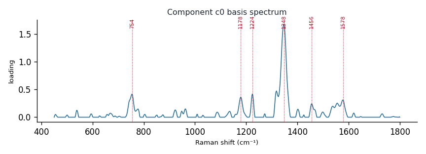

# Component c0

**Audit label:** `protein`  ·  **interpretation confidence:** moderate

**Interpretation (registry).** Latent Raman motif whose reference loadings are dominated by cofactor chemistry (top analyte riboflavin). Perturbation-responsive in 7 dose experiment(s) (up). Serum-spike activators: xanthine, guanine, adenine.

| metric | value |
|---|---|
| bootstrap stability | **0.810** |
| purity (theme) | 0.333 |
| variance share | 0.0351 |
| effective # contributing analytes | 6.3 |
| dominant Raman bands (cm⁻¹) | 754, 1178, 1224, 1348, 1456, 1578 |
| top chemical family (top-8 loadings) | amino_acid |
| dose-responsive experiments | 7 |
| nearest component (basis cosine) | c12 (0.331) |

**Top reference-analyte loadings**
  - riboflavin — 11.46%  (cofactor)
  - riboflavin — 11.43%  (cofactor)
  - tryptophan — 3.81%  (amino_acid)
  - hemoglobin — 3.12%  (protein)
  - myoglobin — 2.93%  (protein)
  - histidine — 2.73%  (amino_acid)
  - leucine — 2.67%  (amino_acid)
  - (+)-glucose — 2.12%  (saccharide)

**Linked biochemical themes** (component→theme weights, ontology v2)
  - `nucleic_purine` — weight **0.306**  ·  
  - `protein_peptide` — weight **0.161**  ·  
  - `sulfur_antioxidant` — weight **0.151**  ·  
  - `redox_broad` — weight **0.090**  ·  
  - `aromatic_amino_acid` — weight **0.089**  ·  

**Linked MSS motifs** (component→motif weights, MSS v1)
  - flavin_redox_cofactor — component weight 0.475
  - porphyrin_macrocycle — component weight 0.230
  - oxopurine_carbonyl — component weight 0.118
  - protein_amide_backbone — component weight 0.106
  - purine_ring_breathing — component weight 0.102
  - aromatic_ring_residue — component weight 0.096

**Collision / redundancy notes**
  - top-5 analytes span 3 chemical families (amino_acid, cofactor, protein) — a mixed/collision component

**Known caveats (registry).** —
