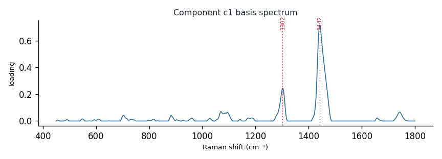

# Component c1

**Audit label:** `triglyceride`  ·  **interpretation confidence:** moderate

**Interpretation (registry).** Latent Raman motif whose reference loadings are dominated by triglyceride chemistry (top analyte elaidic acid). Perturbation-responsive in 4 dose experiment(s) (up). 

| metric | value |
|---|---|
| bootstrap stability | **0.955** |
| purity (theme) | 0.322 |
| variance share | 0.1186 |
| effective # contributing analytes | 8.0 |
| dominant Raman bands (cm⁻¹) | 1302, 1442 |
| top chemical family (top-8 loadings) | triglyceride |
| dose-responsive experiments | 4 |
| nearest component (basis cosine) | c2 (0.521) |

**Top reference-analyte loadings**
  - elaidic acid — 2.68%  (organic_acid)
  - tripalmitolein — 2.59%  (triglyceride)
  - tricaprylin — 2.37%  (triglyceride)
  - tri-11-eicosenoin — 2.37%  (unknown)
  - tricaproin — 2.35%  (triglyceride)
  - trierucin — 2.29%  (triglyceride)
  - vaccenic acid — 2.22%  (organic_acid)
  - trielaidin — 2.10%  (triglyceride)

**Linked biochemical themes** (component→theme weights, ontology v2)
  - `lipid_acyl` — weight **0.600**  ·  
  - `unknown_mixed` — weight **0.250**  ·  
  - `protein_peptide` — weight **0.050**  ·  
  - `sterol_membrane` — weight **0.050**  ·  
  - `saccharide_glycan` — weight **0.050**  ·  

**Linked MSS motifs** (component→motif weights, MSS v1)
  - lipid_acyl_chain — component weight 0.211

**Collision / redundancy notes**
  - top-5 analytes span 3 chemical families (organic_acid, triglyceride, unknown) — a mixed/collision component

**Known caveats (registry).** —
