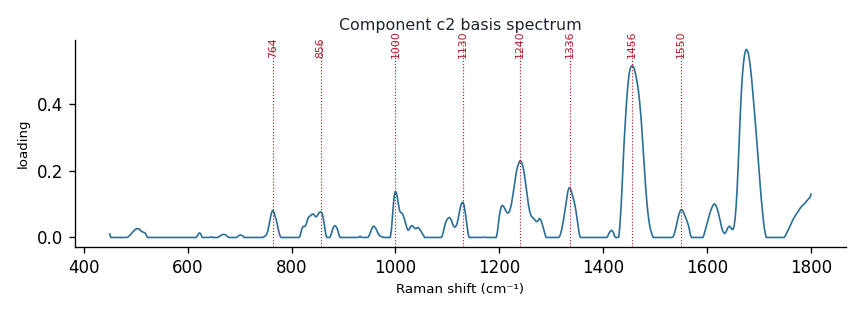

# Component c2

**Audit label:** `protein`  ·  **interpretation confidence:** high

**Interpretation (registry).** Latent Raman motif whose reference loadings are dominated by protein chemistry (top analyte superoxide dismutases). Perturbation-responsive in 5 dose experiment(s) (up/down). Serum-spike activators: ergothioneine, oleate, xanthine.

| metric | value |
|---|---|
| bootstrap stability | **0.965** |
| purity (theme) | 0.803 |
| variance share | 0.1028 |
| effective # contributing analytes | 8.0 |
| dominant Raman bands (cm⁻¹) | 764, 856, 1000, 1130, 1240, 1336, 1456, 1550 |
| top chemical family (top-8 loadings) | protein |
| dose-responsive experiments | 5 |
| nearest component (basis cosine) | c1 (0.521) |

**Top reference-analyte loadings**
  - superoxide dismutases — 4.37%  (protein)
  - ubiquitin — 4.26%  (protein)
  - trypsin — 4.10%  (protein)
  - major proteinase — 4.03%  (protein)
  - elastin — 3.94%  (protein)
  - lectin — 3.86%  (protein)
  - thaumatin — 3.84%  (protein)
  - trypsinogen — 3.76%  (protein)

**Linked biochemical themes** (component→theme weights, ontology v2)
  - `protein_peptide` — weight **0.476**  ·  
  - `sulfur_antioxidant` — weight **0.209**  ·  
  - `aromatic_amino_acid` — weight **0.101**  ·  
  - `heme_porphyrin` — weight **0.076**  ·  
  - `nucleic_purine` — weight **0.062**  ·  

**Linked MSS motifs** (component→motif weights, MSS v1)
  - protein_amide_backbone — component weight 0.489
  - sterol_ring_system — component weight 0.134
  - flavin_redox_cofactor — component weight 0.110
  - porphyrin_macrocycle — component weight 0.096

**Collision / redundancy notes**
  - none flagged

**Known caveats (registry).** —
