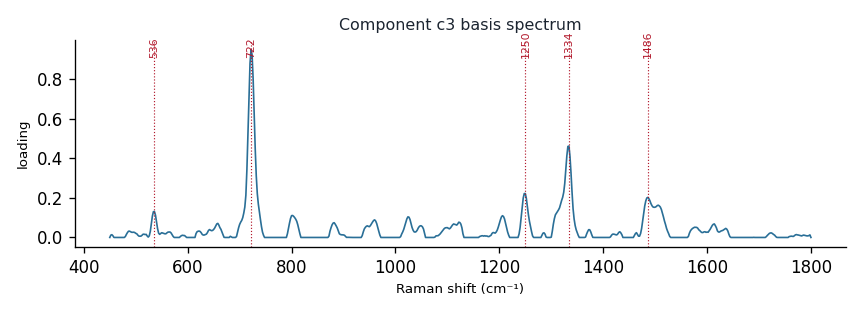

# Component c3

**Audit label:** `sterol`  ·  **interpretation confidence:** moderate

**Interpretation (registry).** Latent Raman motif whose reference loadings are dominated by sterol chemistry (top analyte adenine). Perturbation-responsive in 7 dose experiment(s) (up/down). Serum-spike activators: hypoxanthine, adenine, acetoacetate.

| metric | value |
|---|---|
| bootstrap stability | **0.823** |
| purity (theme) | 0.217 |
| variance share | 0.0315 |
| effective # contributing analytes | 7.5 |
| dominant Raman bands (cm⁻¹) | 536, 722, 1250, 1334, 1486 |
| top chemical family (top-8 loadings) | sterol |
| dose-responsive experiments | 7 |
| nearest component (basis cosine) | c0 (0.245) |

**Top reference-analyte loadings**
  - adenine — 10.92%  (purine)
  - acetyl coenzyme a — 7.74%  (protein)
  - estrone — 7.31%  (sterol)
  - coenzyme a — 5.26%  (cofactor)
  - methionine — 5.12%  (amino_acid)
  - acetyl-coa — 4.63%  (cofactor)
  - estradiol — 3.87%  (sterol)
  - estriol — 3.86%  (sterol)

**Linked biochemical themes** (component→theme weights, ontology v2)
  - `nucleic_purine` — weight **0.473**  ·  
  - `protein_peptide` — weight **0.152**  ·  
  - `sterol_membrane` — weight **0.125**  ·  
  - `sulfur_antioxidant` — weight **0.051**  ·  
  - `nucleic_pyrimidine` — weight **0.036**  ·  

**Linked MSS motifs** (component→motif weights, MSS v1)
  - purine_ring_breathing — component weight 0.374
  - sterol_ring_system — component weight 0.337
  - sulfur_heterocycle_thione — component weight 0.136
  - protein_amide_backbone — component weight 0.104
  - oxopurine_carbonyl — component weight 0.104

**Collision / redundancy notes**
  - top-5 analytes span 5 chemical families (amino_acid, cofactor, protein, purine, sterol) — a mixed/collision component

**Known caveats (registry).** ["low chemical purity — the audit's coarse label is unreliable; trust the reference loadings and perturbation identity over the label."]
