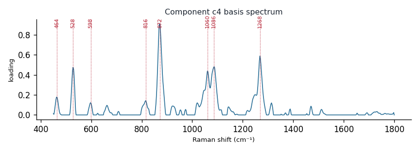

# Component c4

**Audit label:** `saccharide`  ·  **interpretation confidence:** low

**Interpretation (registry).** Latent Raman motif whose reference loadings are dominated by saccharide chemistry (top analyte (+)-galactosamine). Perturbation-responsive in 5 dose experiment(s) (down). Serum-spike activators: oleate, albumin, serine.

| metric | value |
|---|---|
| bootstrap stability | **0.769** |
| purity (theme) | 0.429 |
| variance share | 0.0309 |
| effective # contributing analytes | 7.5 |
| dominant Raman bands (cm⁻¹) | 464, 528, 598, 816, 872, 1060, 1086, 1268 |
| top chemical family (top-8 loadings) | saccharide |
| dose-responsive experiments | 5 |
| nearest component (basis cosine) | c10 (0.320) |

**Top reference-analyte loadings**
  - (+)-galactosamine — 6.87%  (saccharide)
  - galactose — 5.42%  (saccharide)
  - (-)-fructose — 3.83%  (saccharide)
  - fructose — 3.63%  (saccharide)
  - (+)-fucose — 3.54%  (saccharide)
  - (+)-mannose — 2.95%  (saccharide)
  - (-)-ribose — 2.77%  (saccharide)
  - (+)-raffinose pentahydrate — 2.31%  (saccharide)

**Linked biochemical themes** (component→theme weights, ontology v2)
  - `saccharide_glycan` — weight **0.550**  ·  
  - `unknown_mixed` — weight **0.250**  ·  
  - `aromatic_amino_acid` — weight **0.050**  ·  
  - `lipid_acyl` — weight **0.050**  ·  
  - `sterol_membrane` — weight **0.050**  ·  

**Linked MSS motifs** (component→motif weights, MSS v1)
  - glycan_co_network — component weight 0.183

**Collision / redundancy notes**
  - none flagged

**Known caveats (registry).** —
