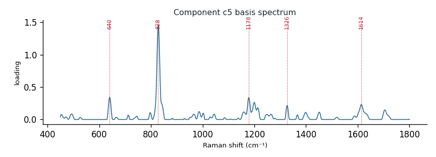

# Component c5

**Audit label:** `amino_acid`  ·  **interpretation confidence:** low

**Interpretation (registry).** Latent Raman motif whose reference loadings are dominated by amino_acid chemistry (top analyte tyrosine). Perturbation-responsive in 7 dose experiment(s) (up/down). Serum-spike activators: ergothioneine, oleate, urate.

| metric | value |
|---|---|
| bootstrap stability | **0.737** |
| purity (theme) | 0.281 |
| variance share | 0.0237 |
| effective # contributing analytes | 6.4 |
| dominant Raman bands (cm⁻¹) | 640, 828, 1178, 1326, 1614 |
| top chemical family (top-8 loadings) | amino_acid |
| dose-responsive experiments | 7 |
| nearest component (basis cosine) | c10 (0.245) |

**Top reference-analyte loadings**
  - tyrosine — 15.63%  (amino_acid)
  - (+)-raffinose pentahydrate — 5.58%  (saccharide)
  - acetoacetate — 4.87%  (organic_acid)
  - diethylstilbestrol — 4.02%  (sterol)
  - phenylalanine — 3.59%  (amino_acid)
  - carotene — 2.84%  (carotenoid)
  - insulin — 2.77%  (protein)
  - (+)-mannose — 2.75%  (saccharide)

**Linked biochemical themes** (component→theme weights, ontology v2)
  - `sulfur_antioxidant` — weight **0.192**  ·  
  - `aromatic_amino_acid` — weight **0.189**  ·  
  - `nucleic_purine` — weight **0.132**  ·  
  - `organic_acid_metabolism` — weight **0.129**  ·  
  - `saccharide_glycan` — weight **0.124**  ·  

**Linked MSS motifs** (component→motif weights, MSS v1)
  - aromatic_ring_residue — component weight 0.317
  - sulfur_heterocycle_thione — component weight 0.108
  - oxopurine_carbonyl — component weight 0.094

**Collision / redundancy notes**
  - top-5 analytes span 4 chemical families (amino_acid, organic_acid, saccharide, sterol) — a mixed/collision component

**Known caveats (registry).** ["low chemical purity — the audit's coarse label is unreliable; trust the reference loadings and perturbation identity over the label.", 'below-threshold bootstrap stability; may be partly a fitting mixture.']
