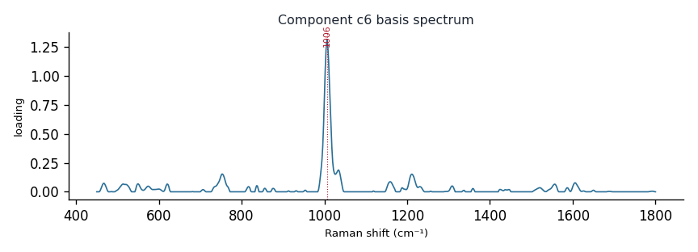

# Component c6

**Audit label:** `protein`  ·  **interpretation confidence:** moderate

**Interpretation (registry).** Latent Raman motif whose reference loadings are dominated by small_nitrogenous chemistry (top analyte urea). Perturbation-responsive in 5 dose experiment(s) (up/down). Serum-spike activators: serine, oleate, riboflavin.

| metric | value |
|---|---|
| bootstrap stability | **0.872** |
| purity (theme) | 0.335 |
| variance share | 0.0439 |
| effective # contributing analytes | 6.7 |
| dominant Raman bands (cm⁻¹) | 1006 |
| top chemical family (top-8 loadings) | amino_acid |
| dose-responsive experiments | 5 |
| nearest component (basis cosine) | c2 (0.138) |

**Top reference-analyte loadings**
  - urea — 11.87%  (small_nitrogenous)
  - ure — 11.17%  (unknown)
  - phenylalanine — 7.33%  (amino_acid)
  - β-carotene — 3.62%  (carotenoid)
  - carotene — 3.39%  (carotenoid)
  - tryptophan — 3.30%  (amino_acid)
  - lectin — 2.92%  (protein)
  - carbonic anhydrase — 2.65%  (protein)

**Linked biochemical themes** (component→theme weights, ontology v2)
  - `sulfur_antioxidant` — weight **0.252**  ·  
  - `protein_peptide` — weight **0.218**  ·  
  - `organic_acid_metabolism` — weight **0.184**  ·  
  - `aromatic_amino_acid` — weight **0.148**  ·  
  - `unknown_mixed` — weight **0.121**  ·  

**Linked MSS motifs** (component→motif weights, MSS v1)
  - aromatic_ring_residue — component weight 0.198
  - colloid_matrix_background — component weight 0.140

**Collision / redundancy notes**
  - top-5 analytes span 4 chemical families (amino_acid, carotenoid, small_nitrogenous, unknown) — a mixed/collision component

**Known caveats (registry).** —
