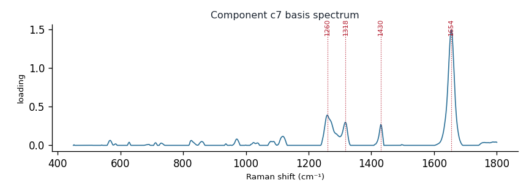

# Component c7

**Audit label:** `protein`  ·  **interpretation confidence:** moderate

**Interpretation (registry).** Latent Raman motif whose reference loadings are dominated by fatty_acid chemistry (top analyte arachidonic acid). Perturbation-responsive in 3 dose experiment(s) (down). Serum-spike activators: glycerol, leucine, urea.

| metric | value |
|---|---|
| bootstrap stability | **0.951** |
| purity (theme) | 0.293 |
| variance share | 0.0679 |
| effective # contributing analytes | 7.5 |
| dominant Raman bands (cm⁻¹) | 1260, 1318, 1430, 1654 |
| top chemical family (top-8 loadings) | fatty_acid |
| dose-responsive experiments | 3 |
| nearest component (basis cosine) | c2 (0.265) |

**Top reference-analyte loadings**
  - arachidonic acid — 6.79%  (fatty_acid)
  - trilinolenin — 6.05%  (triglyceride)
  - α-linolenic acid — 5.66%  (fatty_acid)
  - trilinolein — 4.85%  (triglyceride)
  - linoleic acid — 4.60%  (fatty_acid)
  - palmitoleic acid — 3.02%  (organic_acid)
  - ascorbate — 2.68%  (organic_acid)
  - fumarate — 2.45%  (organic_acid)

**Linked biochemical themes** (component→theme weights, ontology v2)
  - `lipid_acyl` — weight **0.491**  ·  
  - `unknown_mixed` — weight **0.250**  ·  
  - `organic_acid_metabolism` — weight **0.071**  ·  
  - `protein_peptide` — weight **0.062**  ·  
  - `nucleic_purine` — weight **0.042**  ·  

**Linked MSS motifs** (component→motif weights, MSS v1)
  - lipid_acyl_chain — component weight 0.284
  - sterol_ring_system — component weight 0.209

**Collision / redundancy notes**
  - none flagged

**Known caveats (registry).** ["low chemical purity — the audit's coarse label is unreliable; trust the reference loadings and perturbation identity over the label."]
