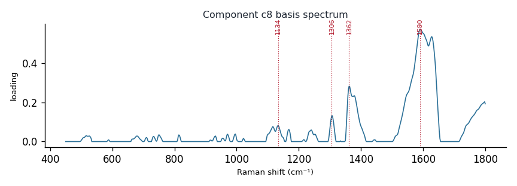

# Component c8

**Audit label:** `protein`  ·  **interpretation confidence:** moderate

**Interpretation (registry).** Latent Raman motif whose reference loadings are dominated by protein chemistry (top analyte melanin). Perturbation-responsive in 6 dose experiment(s) (down). Serum-spike activators: urate, ascorbate, glucose.

| metric | value |
|---|---|
| bootstrap stability | **0.927** |
| purity (theme) | 0.360 |
| variance share | 0.0314 |
| effective # contributing analytes | 7.2 |
| dominant Raman bands (cm⁻¹) | 1134, 1306, 1362, 1590 |
| top chemical family (top-8 loadings) | protein |
| dose-responsive experiments | 6 |
| nearest component (basis cosine) | c0 (0.195) |

**Top reference-analyte loadings**
  - melanin — 16.37%  (unknown)
  - myoglobin — 8.54%  (protein)
  - hemoglobin — 7.64%  (protein)
  - diethylstilbestrol — 6.85%  (sterol)
  - horseradish peroxidase — 6.64%  (protein)
  - cytochrome c — 6.10%  (protein)
  - estriol — 3.67%  (sterol)
  - estradiol — 3.67%  (sterol)

**Linked biochemical themes** (component→theme weights, ontology v2)
  - `nucleic_purine` — weight **0.275**  ·  
  - `protein_peptide` — weight **0.195**  ·  
  - `unknown_mixed` — weight **0.138**  ·  
  - `heme_porphyrin` — weight **0.099**  ·  
  - `sterol_membrane` — weight **0.095**  ·  

**Linked MSS motifs** (component→motif weights, MSS v1)
  - porphyrin_macrocycle — component weight 0.331
  - sterol_ring_system — component weight 0.187
  - flavin_redox_cofactor — component weight 0.110
  - lipid_acyl_chain — component weight 0.073

**Collision / redundancy notes**
  - top-5 analytes span 3 chemical families (protein, sterol, unknown) — a mixed/collision component

**Known caveats (registry).** —
