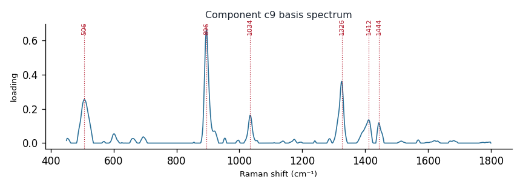

# Component c9

**Audit label:** `amino_acid`  ·  **interpretation confidence:** low

**Interpretation (registry).** Latent Raman motif whose reference loadings are dominated by amino_acid chemistry (top analyte glycine). Perturbation-responsive in 6 dose experiment(s) (up/down). Serum-spike activators: ergothioneine, fructose, rna.

| metric | value |
|---|---|
| bootstrap stability | **0.709** |
| purity (theme) | 0.242 |
| variance share | 0.0257 |
| effective # contributing analytes | 6.7 |
| dominant Raman bands (cm⁻¹) | 506, 896, 1034, 1326, 1412, 1444 |
| top chemical family (top-8 loadings) | saccharide |
| dose-responsive experiments | 6 |
| nearest component (basis cosine) | c10 (0.211) |

**Top reference-analyte loadings**
  - glycine — 13.64%  (amino_acid)
  - (+)-xylose — 5.49%  (saccharide)
  - proline — 4.81%  (amino_acid)
  - chitin — 3.61%  (polysaccharide)
  - glucosamine — 3.45%  (saccharide)
  - gluth — 3.10%  (unknown)
  - (-)-ribose — 2.96%  (saccharide)
  - glutathione — 2.92%  (cofactor)

**Linked biochemical themes** (component→theme weights, ontology v2)
  - `sulfur_antioxidant` — weight **0.321**  ·  
  - `saccharide_glycan` — weight **0.278**  ·  
  - `aromatic_amino_acid` — weight **0.123**  ·  
  - `protein_peptide` — weight **0.109**  ·  
  - `organic_acid_metabolism` — weight **0.092**  ·  

**Linked MSS motifs** (component→motif weights, MSS v1)
  - colloid_matrix_background — component weight 0.106

**Collision / redundancy notes**
  - top-5 analytes span 3 chemical families (amino_acid, polysaccharide, saccharide) — a mixed/collision component

**Known caveats (registry).** ["low chemical purity — the audit's coarse label is unreliable; trust the reference loadings and perturbation identity over the label.", 'below-threshold bootstrap stability; may be partly a fitting mixture.']
