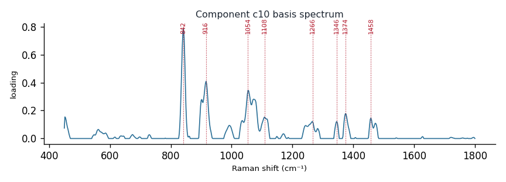

# Component c10

**Audit label:** `saccharide`  ·  **interpretation confidence:** low

**Interpretation (registry).** Latent Raman motif whose reference loadings are dominated by saccharide chemistry (top analyte (-)-arabinose). Perturbation-responsive in 4 dose experiment(s) (down). Serum-spike activators: albumin.

| metric | value |
|---|---|
| bootstrap stability | **0.653** |
| purity (theme) | 0.521 |
| variance share | 0.0229 |
| effective # contributing analytes | 7.9 |
| dominant Raman bands (cm⁻¹) | 842, 916, 1054, 1108, 1266, 1346, 1374, 1458 |
| top chemical family (top-8 loadings) | saccharide |
| dose-responsive experiments | 4 |
| nearest component (basis cosine) | c4 (0.320) |

**Top reference-analyte loadings**
  - (-)-arabinose — 6.20%  (saccharide)
  - (+)-dextrose — 6.08%  (saccharide)
  - β-d-glucose — 5.77%  (saccharide)
  - (+)-glucose — 5.05%  (saccharide)
  - (+)-arabinose — 4.97%  (saccharide)
  - proline — 4.85%  (amino_acid)
  - glucose — 4.17%  (saccharide)
  - (+)-raffinose pentahydrate — 3.79%  (saccharide)

**Linked biochemical themes** (component→theme weights, ontology v2)
  - `saccharide_glycan` — weight **0.553**  ·  
  - `unknown_mixed` — weight **0.262**  ·  
  - `protein_peptide` — weight **0.049**  ·  
  - `aromatic_amino_acid` — weight **0.046**  ·  
  - `lipid_acyl` — weight **0.031**  ·  

**Linked MSS motifs** (component→motif weights, MSS v1)
  - glycan_co_network — component weight 0.201
  - colloid_matrix_background — component weight 0.106
  - lipid_acyl_chain — component weight 0.101

**Collision / redundancy notes**
  - none flagged

**Known caveats (registry).** ['below-threshold bootstrap stability; may be partly a fitting mixture.']
