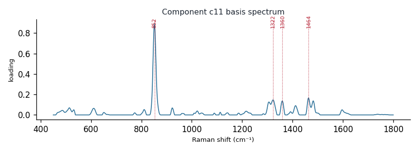

# Component c11

**Audit label:** `amino_acid`  ·  **interpretation confidence:** moderate

**Interpretation (registry).** Latent Raman motif whose reference loadings are dominated by amino_acid chemistry (top analyte hydroxyproline). Perturbation-responsive in 5 dose experiment(s) (up/down). Serum-spike activators: oleate, albumin.

| metric | value |
|---|---|
| bootstrap stability | **0.886** |
| purity (theme) | 0.371 |
| variance share | 0.0403 |
| effective # contributing analytes | 7.2 |
| dominant Raman bands (cm⁻¹) | 852, 1322, 1360, 1464 |
| top chemical family (top-8 loadings) | saccharide |
| dose-responsive experiments | 5 |
| nearest component (basis cosine) | c10 (0.286) |

**Top reference-analyte loadings**
  - hydroxyproline — 9.14%  (amino_acid)
  - alanine — 7.18%  (amino_acid)
  - serine — 6.64%  (amino_acid)
  - (+)-arabinose — 3.99%  (saccharide)
  - (+)-sucrose — 3.41%  (saccharide)
  - glycerol — 3.17%  (polyol)
  - glucosamine — 2.77%  (saccharide)
  - (-)-arabinose — 2.64%  (saccharide)

**Linked biochemical themes** (component→theme weights, ontology v2)
  - `saccharide_glycan` — weight **0.288**  ·  
  - `unknown_mixed` — weight **0.250**  ·  
  - `aromatic_amino_acid` — weight **0.168**  ·  
  - `protein_peptide` — weight **0.151**  ·  
  - `organic_acid_metabolism` — weight **0.059**  ·  

**Linked MSS motifs** (component→motif weights, MSS v1)
  - aromatic_ring_residue — component weight 0.152
  - protein_amide_backbone — component weight 0.104

**Collision / redundancy notes**
  - none flagged

**Known caveats (registry).** —
