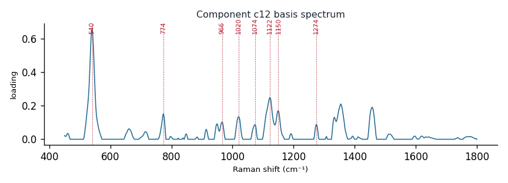

# Component c12

**Audit label:** `saccharide`  ·  **interpretation confidence:** low

**Interpretation (registry).** Latent Raman motif whose reference loadings are dominated by saccharide chemistry (top analyte (+)-dextrose). Perturbation-responsive in 5 dose experiment(s) (down). Serum-spike activators: albumin, oleate, guanine.

| metric | value |
|---|---|
| bootstrap stability | **0.788** |
| purity (theme) | 0.544 |
| variance share | 0.0313 |
| effective # contributing analytes | 7.8 |
| dominant Raman bands (cm⁻¹) | 540, 774, 966, 1020, 1074, 1122, 1150, 1274 |
| top chemical family (top-8 loadings) | saccharide |
| dose-responsive experiments | 5 |
| nearest component (basis cosine) | c18 (0.349) |

**Top reference-analyte loadings**
  - (+)-dextrose — 7.27%  (saccharide)
  - β-d-glucose — 6.33%  (saccharide)
  - (+)-glucose — 4.71%  (saccharide)
  - glucose — 4.58%  (saccharide)
  - valine — 4.26%  (amino_acid)
  - (-)-ribose — 4.21%  (saccharide)
  - (+)-trehalose — 3.83%  (saccharide)
  - (+)-galactosamine — 3.67%  (saccharide)

**Linked biochemical themes** (component→theme weights, ontology v2)
  - `saccharide_glycan` — weight **0.473**  ·  
  - `nucleic_purine` — weight **0.255**  ·  
  - `aromatic_amino_acid` — weight **0.067**  ·  
  - `lipid_acyl` — weight **0.059**  ·  
  - `nucleic_pyrimidine` — weight **0.039**  ·  

**Linked MSS motifs** (component→motif weights, MSS v1)
  - glycan_co_network — component weight 0.160
  - lipid_acyl_chain — component weight 0.104

**Collision / redundancy notes**
  - none flagged

**Known caveats (registry).** —
