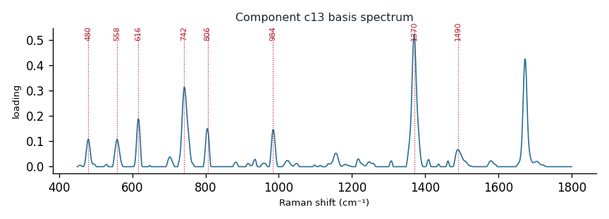

# Component c13

**Audit label:** `pyrimidine`  ·  **interpretation confidence:** low

**Interpretation (registry).** Latent Raman motif whose reference loadings are dominated by pyrimidine chemistry (top analyte thymine). Perturbation-responsive in 7 dose experiment(s) (up/down). Serum-spike activators: hypoxanthine, adenine, phosphate.

| metric | value |
|---|---|
| bootstrap stability | **0.664** |
| purity (theme) | 0.187 |
| variance share | 0.0197 |
| effective # contributing analytes | 5.5 |
| dominant Raman bands (cm⁻¹) | 480, 558, 616, 742, 806, 984, 1370, 1490 |
| top chemical family (top-8 loadings) | protein |
| dose-responsive experiments | 7 |
| nearest component (basis cosine) | c2 (0.296) |

**Top reference-analyte loadings**
  - thymine — 18.66%  (pyrimidine)
  - cytochrome c — 4.00%  (protein)
  - hemoglobin — 3.54%  (protein)
  - b-dna — 2.96%  (nucleic_acid)
  - cholesteryl linoleate — 2.69%  (sterol)
  - myoglobin — 2.59%  (protein)
  - trielaidin — 2.57%  (triglyceride)
  - cholesterol — 2.46%  (lipid)

**Linked biochemical themes** (component→theme weights, ontology v2)
  - `nucleic_purine` — weight **0.314**  ·  
  - `nucleic_pyrimidine` — weight **0.301**  ·  
  - `protein_peptide` — weight **0.126**  ·  
  - `lipid_acyl` — weight **0.061**  ·  
  - `aromatic_amino_acid` — weight **0.058**  ·  

**Linked MSS motifs** (component→motif weights, MSS v1)
  - pyrimidine_ring — component weight 0.299
  - porphyrin_macrocycle — component weight 0.253
  - purine_ring_breathing — component weight 0.103

**Collision / redundancy notes**
  - top-5 analytes span 4 chemical families (nucleic_acid, protein, pyrimidine, sterol) — a mixed/collision component

**Known caveats (registry).** ["low chemical purity — the audit's coarse label is unreliable; trust the reference loadings and perturbation identity over the label.", 'below-threshold bootstrap stability; may be partly a fitting mixture.']
