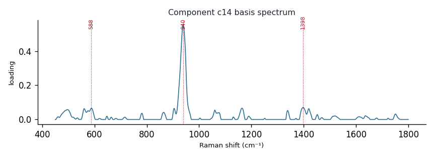

# Component c14

**Audit label:** `organic_acid`  ·  **interpretation confidence:** low

**Interpretation (registry).** Latent Raman motif whose reference loadings are dominated by organic_acid chemistry (top analyte phosphate). Perturbation-responsive in 6 dose experiment(s) (down). Serum-spike activators: oleate, albumin, arginine.

| metric | value |
|---|---|
| bootstrap stability | **0.769** |
| purity (theme) | 0.280 |
| variance share | 0.0295 |
| effective # contributing analytes | 7.5 |
| dominant Raman bands (cm⁻¹) | 588, 940, 1398 |
| top chemical family (top-8 loadings) | organic_acid |
| dose-responsive experiments | 6 |
| nearest component (basis cosine) | c22 (0.151) |

**Top reference-analyte loadings**
  - phosphate — 7.53%  (organic_acid)
  - succinic acid — 6.80%  (organic_acid)
  - aspartic acid — 6.32%  (organic_acid)
  - citrate — 4.14%  (organic_acid)
  - asparagine — 3.97%  (amino_acid)
  - amylopectin — 3.29%  (polysaccharide)
  - amylose — 3.12%  (polysaccharide)
  - xylanase — 3.11%  (protein)

**Linked biochemical themes** (component→theme weights, ontology v2)
  - `organic_acid_metabolism` — weight **0.419**  ·  
  - `nucleic_purine` — weight **0.251**  ·  
  - `saccharide_glycan` — weight **0.084**  ·  
  - `sulfur_antioxidant` — weight **0.084**  ·  
  - `background_matrix` — weight **0.084**  ·  

**Linked MSS motifs** (component→motif weights, MSS v1)
  - carboxylate_organic_acid — component weight 0.349
  - colloid_matrix_background — component weight 0.251

**Collision / redundancy notes**
  - none flagged

**Known caveats (registry).** ["low chemical purity — the audit's coarse label is unreliable; trust the reference loadings and perturbation identity over the label."]
