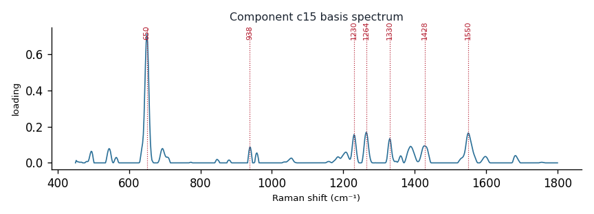

# Component c15

**Audit label:** `purine`  ·  **interpretation confidence:** low

**Interpretation (registry).** Latent Raman motif whose reference loadings are dominated by purine chemistry (top analyte guanine). Perturbation-responsive in 4 dose experiment(s) (up/down). Serum-spike activators: xanthine, guanine, pyruvate.

| metric | value |
|---|---|
| bootstrap stability | **0.787** |
| purity (theme) | 0.303 |
| variance share | 0.0217 |
| effective # contributing analytes | 5.7 |
| dominant Raman bands (cm⁻¹) | 650, 938, 1230, 1264, 1330, 1428, 1550 |
| top chemical family (top-8 loadings) | amino_acid |
| dose-responsive experiments | 4 |
| nearest component (basis cosine) | c22 (0.190) |

**Top reference-analyte loadings**
  - guanine — 15.65%  (purine)
  - xanthine — 13.75%  (purine)
  - cysteine — 5.13%  (amino_acid)
  - (+)-galactose — 3.56%  (saccharide)
  - methionine — 2.75%  (amino_acid)
  - tyrosine — 2.65%  (amino_acid)
  - histidine — 2.01%  (amino_acid)
  - papain — 1.80%  (protein)

**Linked biochemical themes** (component→theme weights, ontology v2)
  - `nucleic_purine` — weight **0.672**  ·  
  - `protein_peptide` — weight **0.122**  ·  
  - `aromatic_amino_acid` — weight **0.116**  ·  
  - `saccharide_glycan` — weight **0.062**  ·  
  - `organic_acid_metabolism` — weight **0.029**  ·  

**Linked MSS motifs** (component→motif weights, MSS v1)
  - oxopurine_carbonyl — component weight 0.442
  - purine_ring_breathing — component weight 0.316
  - sulfur_heterocycle_thione — component weight 0.176
  - sterol_ring_system — component weight 0.134
  - protein_amide_backbone — component weight 0.100

**Collision / redundancy notes**
  - top-5 analytes span 3 chemical families (amino_acid, purine, saccharide) — a mixed/collision component

**Known caveats (registry).** —
