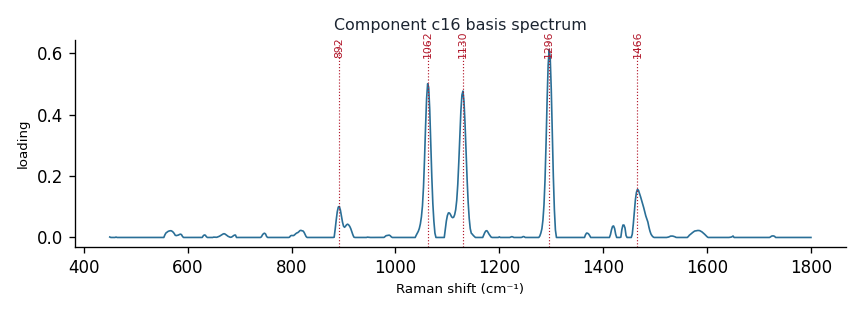

# Component c16

**Audit label:** `triglyceride`  ·  **interpretation confidence:** moderate

**Interpretation (registry).** Latent Raman motif whose reference loadings are dominated by fatty_acid chemistry (top analyte myristic acid). Perturbation-responsive in 5 dose experiment(s) (up/down). Serum-spike activators: oleate, adenine, histidine.

| metric | value |
|---|---|
| bootstrap stability | **0.847** |
| purity (theme) | 0.350 |
| variance share | 0.0397 |
| effective # contributing analytes | 8.0 |
| dominant Raman bands (cm⁻¹) | 892, 1062, 1130, 1296, 1466 |
| top chemical family (top-8 loadings) | fatty_acid |
| dose-responsive experiments | 5 |
| nearest component (basis cosine) | c18 (0.323) |

**Top reference-analyte loadings**
  - myristic acid — 4.66%  (fatty_acid)
  - arachidic acid — 4.35%  (fatty_acid)
  - palmitic acid — 4.24%  (fatty_acid)
  - lauric acid — 4.18%  (fatty_acid)
  - tribehenin — 4.13%  (triglyceride)
  - triarachidin — 4.08%  (triglyceride)
  - tristearin — 4.08%  (triglyceride)
  - tripalmitin — 3.90%  (triglyceride)

**Linked biochemical themes** (component→theme weights, ontology v2)
  - `lipid_acyl` — weight **0.575**  ·  
  - `nucleic_purine` — weight **0.275**  ·  
  - `saccharide_glycan` — weight **0.075**  ·  
  - `protein_peptide` — weight **0.025**  ·  
  - `organic_acid_metabolism` — weight **0.025**  ·  

**Linked MSS motifs** (component→motif weights, MSS v1)
  - lipid_acyl_chain — component weight 0.226

**Collision / redundancy notes**
  - none flagged

**Known caveats (registry).** —
