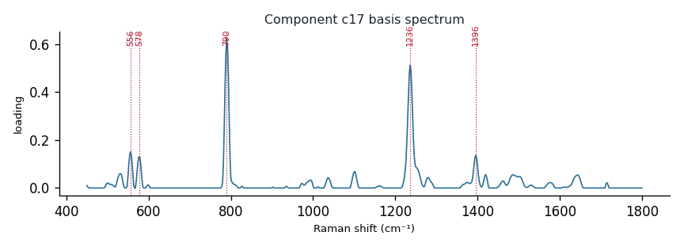

# Component c17

**Audit label:** `pyrimidine`  ·  **interpretation confidence:** moderate

**Interpretation (registry).** Latent Raman motif whose reference loadings are dominated by pyrimidine chemistry (top analyte uracil). Perturbation-responsive in 5 dose experiment(s) (up/down). 

| metric | value |
|---|---|
| bootstrap stability | **0.819** |
| purity (theme) | 0.253 |
| variance share | 0.0211 |
| effective # contributing analytes | 6.2 |
| dominant Raman bands (cm⁻¹) | 556, 578, 790, 1236, 1396 |
| top chemical family (top-8 loadings) | nucleic_acid |
| dose-responsive experiments | 5 |
| nearest component (basis cosine) | c23 (0.383) |

**Top reference-analyte loadings**
  - uracil — 16.91%  (pyrimidine)
  - cytosine — 8.27%  (pyrimidine)
  - t-rna — 5.35%  (nucleic_acid)
  - riboflavin — 4.33%  (cofactor)
  - b-dna — 3.21%  (nucleic_acid)
  - a-dna — 3.02%  (nucleic_acid)
  - (+)-galactose — 2.65%  (saccharide)
  - urate — 2.32%  (purine)

**Linked biochemical themes** (component→theme weights, ontology v2)
  - `nucleic_pyrimidine` — weight **0.468**  ·  
  - `background_matrix` — weight **0.285**  ·  
  - `nucleic_purine` — weight **0.089**  ·  
  - `sulfur_antioxidant` — weight **0.056**  ·  
  - `organic_acid_metabolism` — weight **0.041**  ·  

**Linked MSS motifs** (component→motif weights, MSS v1)
  - pyrimidine_ring — component weight 0.429
  - flavin_redox_cofactor — component weight 0.141
  - carboxylate_organic_acid — component weight 0.089
  - oxopurine_carbonyl — component weight 0.088

**Collision / redundancy notes**
  - top-5 analytes span 3 chemical families (cofactor, nucleic_acid, pyrimidine) — a mixed/collision component

**Known caveats (registry).** ["low chemical purity — the audit's coarse label is unreliable; trust the reference loadings and perturbation identity over the label."]
