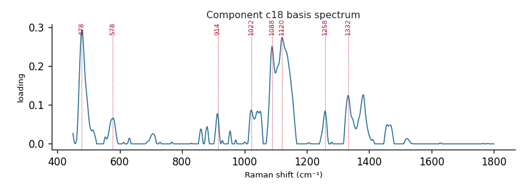

# Component c18

**Audit label:** `saccharide`  ·  **interpretation confidence:** moderate

**Interpretation (registry).** Latent Raman motif whose reference loadings are dominated by polysaccharide chemistry (top analyte cellulose). Perturbation-responsive in 6 dose experiment(s) (up/down). Serum-spike activators: ergothioneine, urate, histidine.

| metric | value |
|---|---|
| bootstrap stability | **0.882** |
| purity (theme) | 0.367 |
| variance share | 0.0370 |
| effective # contributing analytes | 7.9 |
| dominant Raman bands (cm⁻¹) | 478, 578, 914, 1022, 1088, 1120, 1258, 1332 |
| top chemical family (top-8 loadings) | polysaccharide |
| dose-responsive experiments | 6 |
| nearest component (basis cosine) | c12 (0.349) |

**Top reference-analyte loadings**
  - cellulose — 6.20%  (polysaccharide)
  - lactose — 5.62%  (saccharide)
  - lactate — 5.43%  (organic_acid)
  - (+)-lactose — 5.17%  (saccharide)
  - amylopectin — 5.07%  (polysaccharide)
  - amylose — 4.79%  (polysaccharide)
  - xylanase — 4.61%  (protein)
  - chitin — 3.76%  (polysaccharide)

**Linked biochemical themes** (component→theme weights, ontology v2)
  - `saccharide_glycan` — weight **0.447**  ·  
  - `sulfur_antioxidant` — weight **0.216**  ·  
  - `protein_peptide` — weight **0.102**  ·  
  - `organic_acid_metabolism` — weight **0.087**  ·  
  - `nucleic_purine` — weight **0.061**  ·  

**Linked MSS motifs** (component→motif weights, MSS v1)
  - glycan_co_network — component weight 0.176
  - protein_amide_backbone — component weight 0.097

**Collision / redundancy notes**
  - top-5 analytes span 3 chemical families (organic_acid, polysaccharide, saccharide) — a mixed/collision component

**Known caveats (registry).** —
