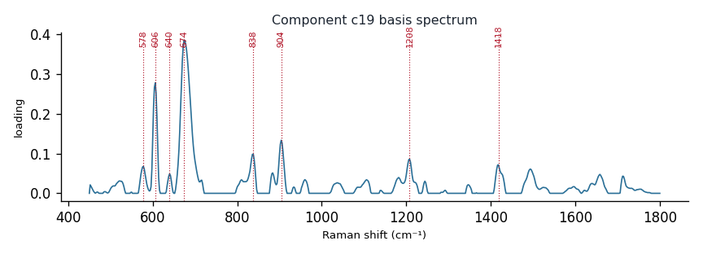

# Component c19

**Audit label:** `protein`  ·  **interpretation confidence:** moderate

**Interpretation (registry).** Latent Raman motif whose reference loadings are dominated by small_nitrogenous chemistry (top analyte creatinine). Perturbation-responsive in 5 dose experiment(s) (up/down). Serum-spike activators: xanthine, guanine, oleate.

| metric | value |
|---|---|
| bootstrap stability | **0.825** |
| purity (theme) | 0.192 |
| variance share | 0.0184 |
| effective # contributing analytes | 6.4 |
| dominant Raman bands (cm⁻¹) | 578, 606, 640, 674, 838, 904, 1208, 1418 |
| top chemical family (top-8 loadings) | saccharide |
| dose-responsive experiments | 5 |
| nearest component (basis cosine) | c9 (0.196) |

**Top reference-analyte loadings**
  - creatinine — 13.93%  (small_nitrogenous)
  - tubulin — 8.83%  (protein)
  - gluth — 3.56%  (unknown)
  - ergothioneine — 3.37%  (cofactor)
  - cysteine — 2.97%  (amino_acid)
  - (-)-arabinose — 2.90%  (saccharide)
  - mannose — 2.90%  (saccharide)
  - phosphatidylinositol — 2.64%  (lipid)

**Linked biochemical themes** (component→theme weights, ontology v2)
  - `nucleic_purine` — weight **0.310**  ·  
  - `protein_peptide` — weight **0.177**  ·  
  - `organic_acid_metabolism` — weight **0.168**  ·  
  - `saccharide_glycan` — weight **0.117**  ·  
  - `sulfur_antioxidant` — weight **0.084**  ·  

**Linked MSS motifs** (component→motif weights, MSS v1)
  - sulfur_heterocycle_thione — component weight 0.281
  - aromatic_ring_residue — component weight 0.104

**Collision / redundancy notes**
  - top-5 analytes span 5 chemical families (amino_acid, cofactor, protein, small_nitrogenous, unknown) — a mixed/collision component

**Known caveats (registry).** ["low chemical purity — the audit's coarse label is unreliable; trust the reference loadings and perturbation identity over the label."]
