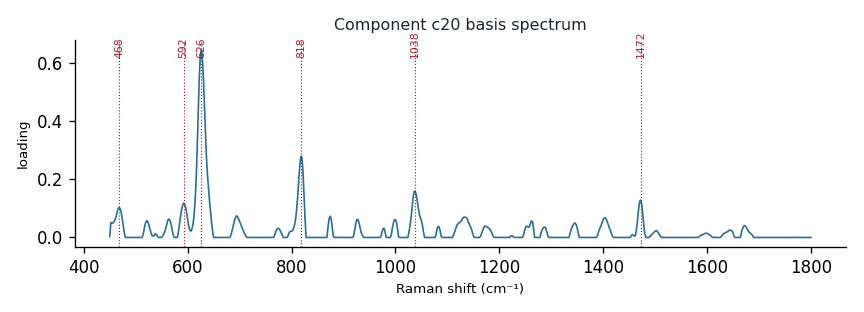

# Component c20

**Audit label:** `saccharide`  ·  **interpretation confidence:** low

**Interpretation (registry).** Latent Raman motif whose reference loadings are dominated by saccharide chemistry (top analyte fructose). Perturbation-responsive in 4 dose experiment(s) (up/down). Serum-spike activators: galactose, hydroxyproline, arginine.

| metric | value |
|---|---|
| bootstrap stability | **0.768** |
| purity (theme) | 0.400 |
| variance share | 0.0212 |
| effective # contributing analytes | 7.1 |
| dominant Raman bands (cm⁻¹) | 468, 592, 626, 818, 1038, 1472 |
| top chemical family (top-8 loadings) | saccharide |
| dose-responsive experiments | 4 |
| nearest component (basis cosine) | c5 (0.182) |

**Top reference-analyte loadings**
  - fructose — 11.19%  (saccharide)
  - (-)-fructose — 10.26%  (saccharide)
  - urate — 6.08%  (purine)
  - ascorbate — 4.78%  (organic_acid)
  - cysteine — 3.79%  (amino_acid)
  - acetyl coenzyme a — 3.40%  (protein)
  - 2-deoxy-d-ribose — 3.38%  (saccharide)
  - diethylstilbestrol — 3.25%  (sterol)

**Linked biochemical themes** (component→theme weights, ontology v2)
  - `saccharide_glycan` — weight **0.356**  ·  
  - `background_matrix` — weight **0.253**  ·  
  - `nucleic_purine` — weight **0.109**  ·  
  - `aromatic_amino_acid` — weight **0.109**  ·  
  - `organic_acid_metabolism` — weight **0.061**  ·  

**Linked MSS motifs** (component→motif weights, MSS v1)
  - oxopurine_carbonyl — component weight 0.153
  - glycan_co_network — component weight 0.152
  - sulfur_heterocycle_thione — component weight 0.112

**Collision / redundancy notes**
  - top-5 analytes span 4 chemical families (amino_acid, organic_acid, purine, saccharide) — a mixed/collision component

**Known caveats (registry).** —
