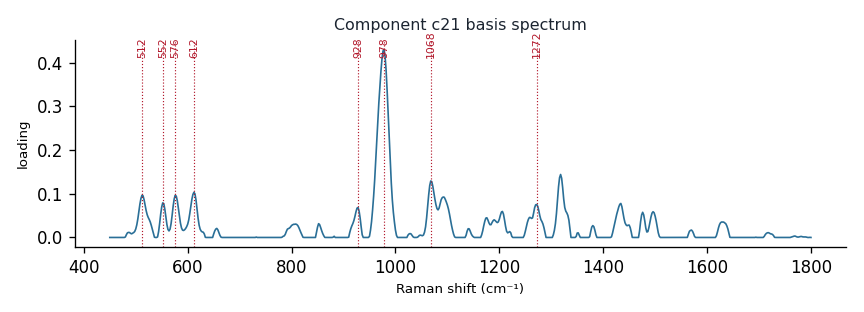

# Component c21

**Audit label:** `saccharide`  ·  **interpretation confidence:** low

**Interpretation (registry).** Latent Raman motif whose reference loadings are dominated by saccharide chemistry (top analyte fructose-6-phosphate). Perturbation-responsive in 6 dose experiment(s) (down). Serum-spike activators: albumin.

| metric | value |
|---|---|
| bootstrap stability | **0.769** |
| purity (theme) | 0.293 |
| variance share | 0.0235 |
| effective # contributing analytes | 7.4 |
| dominant Raman bands (cm⁻¹) | 512, 552, 576, 612, 928, 978, 1068, 1272 |
| top chemical family (top-8 loadings) | saccharide |
| dose-responsive experiments | 6 |
| nearest component (basis cosine) | c4 (0.239) |

**Top reference-analyte loadings**
  - fructose-6-phosphate — 9.40%  (saccharide)
  - arginine — 8.57%  (amino_acid)
  - n-acetyl- d-glucosamine — 6.04%  (saccharide)
  - histidine — 5.46%  (amino_acid)
  - ergothioneine — 5.27%  (cofactor)
  - n-acetylglucosamine — 4.33%  (saccharide)
  - ure — 3.51%  (unknown)
  - malic acid — 2.73%  (organic_acid)

**Linked biochemical themes** (component→theme weights, ontology v2)
  - `saccharide_glycan` — weight **0.295**  ·  
  - `background_matrix` — weight **0.254**  ·  
  - `sulfur_antioxidant` — weight **0.102**  ·  
  - `aromatic_amino_acid` — weight **0.079**  ·  
  - `organic_acid_metabolism` — weight **0.074**  ·  

**Linked MSS motifs** (component→motif weights, MSS v1)
  - colloid_matrix_background — component weight 0.218
  - sulfur_heterocycle_thione — component weight 0.186
  - glycan_co_network — component weight 0.128
  - pyrimidine_ring — component weight 0.081

**Collision / redundancy notes**
  - top-5 analytes span 3 chemical families (amino_acid, cofactor, saccharide) — a mixed/collision component

**Known caveats (registry).** ["low chemical purity — the audit's coarse label is unreliable; trust the reference loadings and perturbation identity over the label."]
