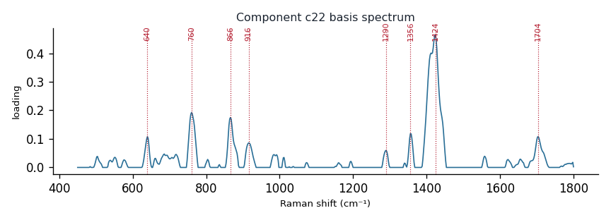

# Component c22

**Audit label:** `protein`  ·  **interpretation confidence:** low

**Interpretation (registry).** Latent Raman motif whose reference loadings are dominated by amino_acid chemistry (top analyte fumarate). Perturbation-responsive in 6 dose experiment(s) (down). Serum-spike activators: ergothioneine, urate, albumin.

| metric | value |
|---|---|
| bootstrap stability | **0.735** |
| purity (theme) | 0.222 |
| variance share | 0.0289 |
| effective # contributing analytes | 7.8 |
| dominant Raman bands (cm⁻¹) | 640, 760, 866, 916, 1290, 1356, 1424, 1704 |
| top chemical family (top-8 loadings) | amino_acid |
| dose-responsive experiments | 6 |
| nearest component (basis cosine) | c1 (0.308) |

**Top reference-analyte loadings**
  - fumarate — 5.59%  (organic_acid)
  - asparagine — 3.98%  (amino_acid)
  - acetoacetate — 3.80%  (organic_acid)
  - glutamate — 3.69%  (amino_acid)
  - aspartate — 3.63%  (organic_acid)
  - tryptophan — 3.58%  (amino_acid)
  - gluth — 3.20%  (unknown)
  - methionine — 2.61%  (amino_acid)

**Linked biochemical themes** (component→theme weights, ontology v2)
  - `organic_acid_metabolism` — weight **0.286**  ·  
  - `aromatic_amino_acid` — weight **0.164**  ·  
  - `nucleic_purine` — weight **0.153**  ·  
  - `sulfur_antioxidant` — weight **0.150**  ·  
  - `protein_peptide` — weight **0.086**  ·  

**Linked MSS motifs** (component→motif weights, MSS v1)
  - carboxylate_organic_acid — component weight 0.165
  - flavin_redox_cofactor — component weight 0.165
  - aromatic_ring_residue — component weight 0.133
  - porphyrin_macrocycle — component weight 0.090

**Collision / redundancy notes**
  - none flagged

**Known caveats (registry).** ["low chemical purity — the audit's coarse label is unreliable; trust the reference loadings and perturbation identity over the label.", 'below-threshold bootstrap stability; may be partly a fitting mixture.']
