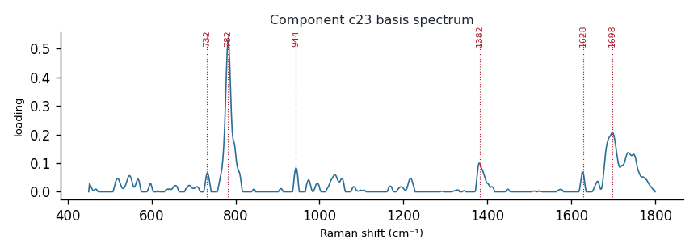

# Component c23

**Audit label:** `organic_acid`  ·  **interpretation confidence:** low

**Interpretation (registry).** Latent Raman motif whose reference loadings are dominated by organic_acid chemistry (top analyte phosphoenolpyruvate). Perturbation-responsive in 5 dose experiment(s) (up/down). Serum-spike activators: oleate, albumin, serine.

| metric | value |
|---|---|
| bootstrap stability | **0.781** |
| purity (theme) | 0.428 |
| variance share | 0.0196 |
| effective # contributing analytes | 7.5 |
| dominant Raman bands (cm⁻¹) | 732, 782, 944, 1382, 1628, 1698 |
| top chemical family (top-8 loadings) | organic_acid |
| dose-responsive experiments | 5 |
| nearest component (basis cosine) | c17 (0.383) |

**Top reference-analyte loadings**
  - phosphoenolpyruvate — 11.66%  (organic_acid)
  - citrate — 10.59%  (organic_acid)
  - pyruvate — 9.05%  (organic_acid)
  - cytosine — 6.22%  (pyrimidine)
  - a-dna — 5.27%  (nucleic_acid)
  - aspartic acid — 5.00%  (organic_acid)
  - t-rna — 4.97%  (nucleic_acid)
  - b-dna — 4.56%  (nucleic_acid)

**Linked biochemical themes** (component→theme weights, ontology v2)
  - `organic_acid_metabolism` — weight **0.342**  ·  
  - `nucleic_purine` — weight **0.340**  ·  
  - `nucleic_pyrimidine` — weight **0.169**  ·  
  - `heme_porphyrin` — weight **0.075**  ·  
  - `aromatic_amino_acid` — weight **0.025**  ·  

**Linked MSS motifs** (component→motif weights, MSS v1)
  - carboxylate_organic_acid — component weight 0.397
  - pyrimidine_ring — component weight 0.191
  - colloid_matrix_background — component weight 0.179
  - purine_ring_breathing — component weight 0.106

**Collision / redundancy notes**
  - top-5 analytes span 3 chemical families (nucleic_acid, organic_acid, pyrimidine) — a mixed/collision component

**Known caveats (registry).** —
