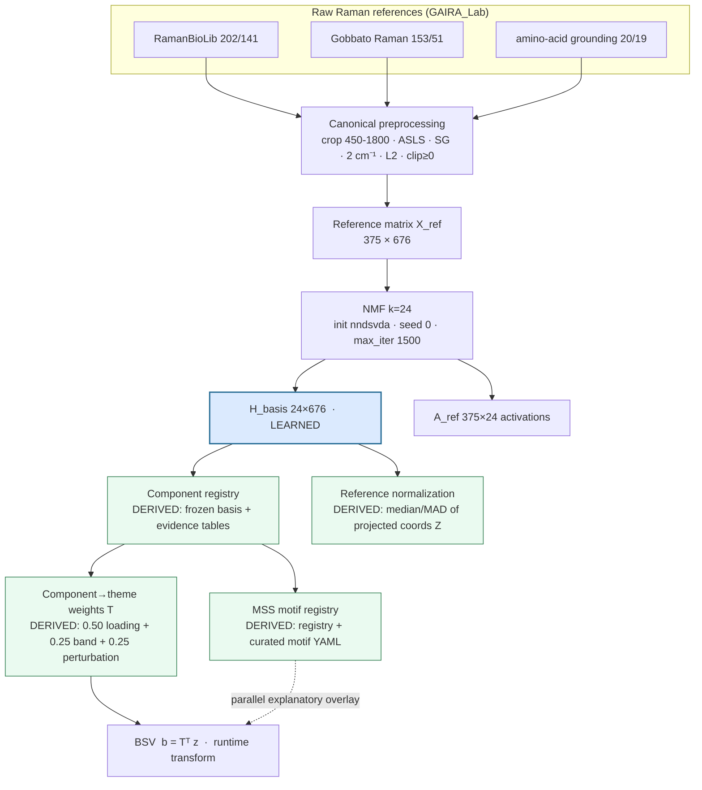
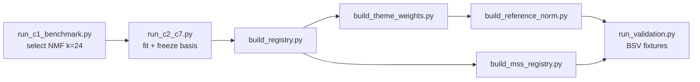
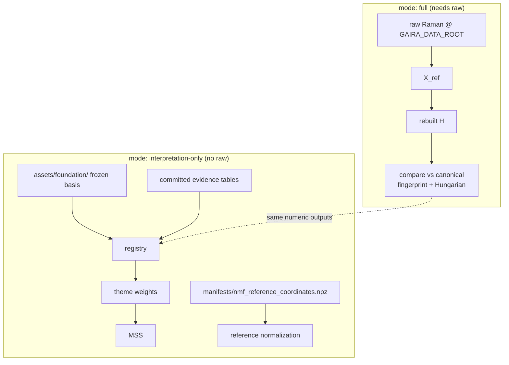

# GAIRA V5 Foundation Reproduction

## 1. Purpose

This package reproduces the **GAIRA Raman-only foundation** and all of its deterministic
interpretation layers on another computer. It is self-contained: an intern with the repo,
the same raw datasets, and the documented environment can regenerate the foundation without
reading the entire audit history.

- **Raman reference spectra build the foundation.**
- **SERS datasets do not train the NMF.**
- SERS is used only for perturbation/transfer **evaluation** (and, as documented
  annotation *evidence*, never as representation training).
- **The learned object is the 24-component NMF basis** (`H_basis`).
- The **component registry, component→theme weights, MSS registry, reference
  normalization, and BSV** are **deterministic downstream layers** — no training.

The orchestration script lives at **`tools/reproduce_gaira_foundation.py`**; the tests at
**`tests/test_reproduce_foundation.py`**. This directory is the documentation + manifests
package. See `manifests/reproduction_file_map.json` for where every file lives.

## 2. Actual wired architecture (as implemented)

```text
Pure Raman reference datasets
        ↓
Canonical preprocessing
        ↓
Reference matrix X_ref
        ↓
NMF
        ↓
24 basis spectra H_basis  +  reference activations A_ref
        ↓
Component registry
        ├──────────────→ MSS motifs          (parallel interpretive projection)
        │
        └→ component→theme matrix T → BSV
```

- **MSS and themes are parallel interpretive projections** of the frozen component layer.
- **MSS does not feed the BSV.** The BSV is computed from component coordinates through the
  component→theme matrix: `b_query = Tᵀ · z_query`.
- MSS derivation actually *consumes* the theme weights (it is downstream of / parallel to
  themes, never their source).

## 3. Data required

The Raman foundation uses exactly three sources (verified counts):

| Source | Spectra | Labels |
|---|---:|---:|
| RamanBioLib | 202 | 141 |
| Gobbato Raman metabolites | 153 | 51 |
| amino-acid Raman grounding | 20 | 19 |
| **Union → X_ref** | **375** | **167** |

≈ **161 distinct molecules** (167 labels include ~6 unmerged canonicalization duplicates,
e.g. an abbreviation or a Unicode ligature — see `audits/nmf_build_trace.md`).

You must have access to the same raw data tree. **Do not assume the disk is named
`SSD_Rad`** — point the tools at your copy via `GAIRA_DATA_ROOT` (§4). Full per-spectrum
provenance (sanitized, no absolute paths): `manifests/corpus_manifest.csv`.

## 4. Data-root setup

Environment variable (recommended):
```bash
export GAIRA_DATA_ROOT=/absolute/path/to/GAIRA_DATA/raw
```
Explicit argument:
```bash
python tools/reproduce_gaira_foundation.py \
    --mode full --data-root /absolute/path/to/GAIRA_DATA/raw \
    --output-dir results/reproduction/my_run
```
**Precedence:** `--data-root` → `$GAIRA_DATA_ROOT` → a documented optional default → clear
error. Expected layout under the data-root: `serum_ag_colloids/dataset_spectral_data.zip`,
`amino_acid_raman_grounding/aa.xlsx`, and the RamanBioLib parquet (in-repo at
`streamlit_apps/gaira_demo/data/grounding_molecule_spectra.parquet`, or pass
`--ramanbiolib-parquet`).

## 5. Environment

Verified on: **Python 3.12.7 · NumPy 2.4.3 · SciPy 1.17.1 · scikit-learn 1.8.0** (macOS
arm64, clang/aarch64 BLAS). Pin `scikit-learn==1.8.0` (`requirements_vm.txt`).

> **The same seed alone is not sufficient for guaranteed byte identity across different
> numerical stacks.** Coordinate-descent NMF numerics can change with the sklearn/BLAS
> version. A different environment may produce an **equivalent but reordered or slightly
> different** basis — in which case downstream integer-index annotations must be transferred
> only after Hungarian component alignment (§13).

## 6. Canonical preprocessing (exact)

```text
crop 450–1800 cm⁻¹
→ ASLS baseline:  λ = 1e5,  p = 0.01,  iterations = 8
→ Savitzky–Golay:  window = 9,  polynomial order = 3
→ resample to a fixed 2 cm⁻¹ grid  →  676 bins
→ L2 normalization
→ clip negative values (for NMF)
```
**Every training spectrum passes through this exact path.** Full values:
`audits/preprocessing_parameters.json`.

## 7. Exact NMF configuration (verified from the fitted estimator)

```python
NMF(
    n_components=24,
    init="nndsvda",
    solver="cd",
    beta_loss="frobenius",
    alpha_W=0.0,
    alpha_H="same",     # effectively 0 because alpha_W=0.0
    l1_ratio=0.0,
    max_iter=1500,
    tol=1e-4,
    random_state=0,
    shuffle=False,
)
```
`H_basis` has shape **24 × 676**; `A_ref` contains the training activations (375 × 24). The
basis is the only learned foundation object. Full values: `audits/nmf_parameters.json`.

## 8. Why 24 components

Selected by the V5 representation benchmark: five representation families × six candidate
latent sizes, on an analyte-grouped held-out protocol. The raw top score is **ICA k=32**;
**NMF k=24** is selected through the pre-stated **non-negative, parts-based tie-break** (a
biochemical proportion cannot be negative), and the basis was rebuilt **byte-for-byte**.
24 is **not claimed to be universally optimal** — it is the selected **canonical V5
foundation resolution**.

## 9. Full reproduction command

```bash
python tools/reproduce_gaira_foundation.py \
    --mode full --data-root "$GAIRA_DATA_ROOT" \
    --output-dir results/reproduction/my_run
```
Stages executed: (1) load Raman corpus; (2) preprocess; (3) construct `X_ref`; (4) fit NMF;
(5) save `A_ref` and `H_basis`; (6) compare basis with the canonical atlas; (7) build
component registry; (8) build component→theme weights; (9) build MSS registry; (10) build
reference normalization; (11) run BSV regression checks; (12) emit manifest + report. It
writes only to `--output-dir` and **never** modifies `assets/foundation/`.

## 10. Interpretation-only reproduction

```bash
python tools/reproduce_gaira_foundation.py \
    --mode interpretation-only --foundation-root assets/foundation \
    --output-dir results/reproduction/interp
```
- **No raw Raman data required.** Uses the frozen basis + committed assets.
- Rebuilds the deterministic interpretation outputs (registry, theme weights, MSS, BSV).
- Reference-normalization rebuilding needs the projected reference coordinates when raw data
  are absent. **That artifact IS included** — `manifests/nmf_reference_coordinates.npz`
  (375 × 24, ~44 KB) — and interpretation-only mode auto-detects it, so reference
  normalization rebuilds with no raw data.

## 11. Expected outputs (actual names emitted)

`reproduction_run/` contains: `run_manifest.json`, `environment.json`, `dataset_role_map.csv`,
`corpus_manifest.csv`, `preprocessing_config.json`, `preprocessed_reference_matrix.npz`,
`nmf_reference_coordinates.npz`, `nmf_basis.npz`, `nmf_training_activations.npz`,
`nmf_metrics.json`, `basis_comparison.json`, `component_alignment.csv`,
`component_registry_v1.json`, `component_theme_weights_v1.json`, `mss_registry_v1.json`,
`reference_normalization_v1.json`, `reference_support.npz`, `bsv_regression_results.json`,
`downstream_comparison.json`, `reproduction_report.md`. (Interpretation-only omits the
corpus/matrix/basis artifacts.) Curated small examples: `example_outputs/`.

## 12. Success criteria

A successful **canonical** reproduction reports:
- exact array equality: **true**
- maximum absolute basis difference: **0.0**
- rebuilt fingerprint: **`09ed804a40836f4a05a91ba10900cded`**
- component→theme weights: **identical**
- MSS registry: **identical**
- numeric component registry content: **identical**
- reference center/spread: **identical**
- BSV fixtures: **identical**

Separately, a **cosmetic** set-order string difference may appear in the registry's
`current_interpretation` (`(up/down)` vs `(down/up)`) — `PYTHONHASHSEED`-dependent, numeric
content unaffected.

## 13. Component alignment

Integer component IDs (`c0…c23`) are **not semantically anchored** across an
environment-shifted rebuild — a different numerical stack can permute them. Therefore:
- compare basis spectra by **cosine similarity**;
- align rebuilt components to canonical via **Hungarian matching** (the script does this in
  `basis_comparison.json` / `component_alignment.csv`);
- transfer any downstream (index-keyed) annotation **only after alignment**;
- an **exact** canonical rebuild needs no permutation because the basis arrays match
  byte-for-byte (identity alignment).

## 14. Learned, derived, and curated layers

| Layer | Type | Inputs |
|---|---|---|
| 24 NMF basis spectra | **Learned** | Raman reference matrix `X_ref` |
| Component registry | Derived | basis + Raman reference evidence tables |
| Component→theme weights `T` | Derived | loadings + bands + perturbation mappings |
| MSS definitions | **Curated** | literature-informed bands / exemplars / themes |
| MSS component contributors | Derived | registry + theme weights + MSS definitions |
| Reference normalization | Derived | projected Raman reference coordinates `Z` |
| BSV | Deterministic runtime transform | component coordinates + theme matrix `T` |

## 15. Known limitations

- Exact byte identity is **numerical-environment-sensitive** (§5).
- Component ordering is **not semantically anchored** across independent rebuilds (§13).
- One **cosmetic** registry description string is affected by unordered `set` joining (§12).
- The **RamanBioLib parquet** may not be committed; it must be available in-repo or under
  the data-root for full mode.
- The **raw corpus is required for full mode**; interpretation-only needs none.
- **SERS is external validation / annotation evidence, not foundation training.**

## 16. Troubleshooting

| Symptom | Fix |
|---|---|
| `no raw data-root found` | set `GAIRA_DATA_ROOT` or pass `--data-root`. |
| RamanBioLib parquet missing | place it in-repo, or pass `--ramanbiolib-parquet`, or under the data-root. |
| fingerprint mismatch | wrong sklearn/BLAS — install `scikit-learn==1.8.0`; then re-check `basis_comparison.json`. |
| basis matches only after alignment | expected on a different stack — use the Hungarian permutation before transferring annotations (§13). |
| `REFUSING to write inside assets/foundation/` | choose a different `--output-dir`; canonical assets are protected. |
| output-dir permission error | pick a writable `--output-dir` (e.g. under `results/reproduction/`). |

## 17. Verification commands

```bash
python -m pytest tests/test_reproduce_foundation.py -q          # 13 tests, no raw data needed
cat results/reproduction/my_run/reproduction_run/basis_comparison.json    # inspect the basis comparison
```
The authoritative verification of this package is `VERIFICATION_REPORT.md` (full + interp
runs, frozen-asset integrity, tests). The operational checklist is
`REPRODUCTION_CHECKLIST.md`.

## 18. Pipeline diagrams (Mermaid)

**End-to-end scientific pipeline** — learned once, then deterministic downstream:



**Deterministic build order** (per `results/v5_rebuild/engine_v1/MIGRATION_NOTES.md`):



**Reproduction dependency graph** — what each mode needs:



Every derived layer is a pure function of the frozen basis + committed tables (+ curated
YAML). Only reference normalization needs the projected coordinates `Z`, which are
committed as the 44 KB `manifests/nmf_reference_coordinates.npz` so interpretation-only mode
needs no raw data.
